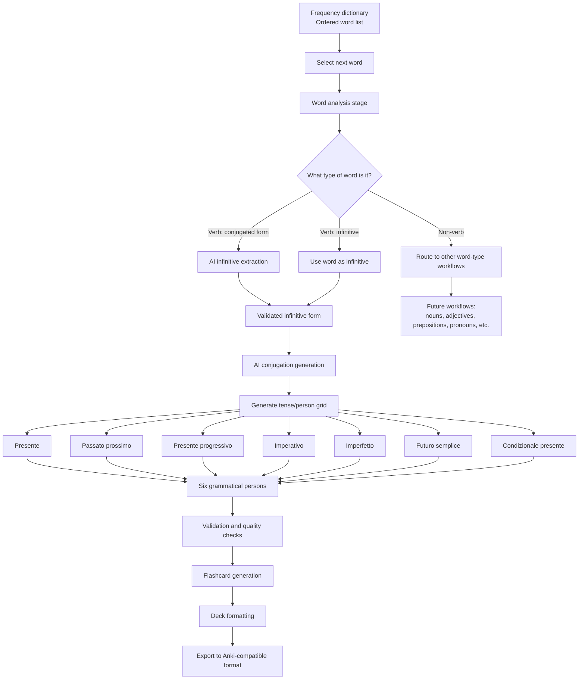
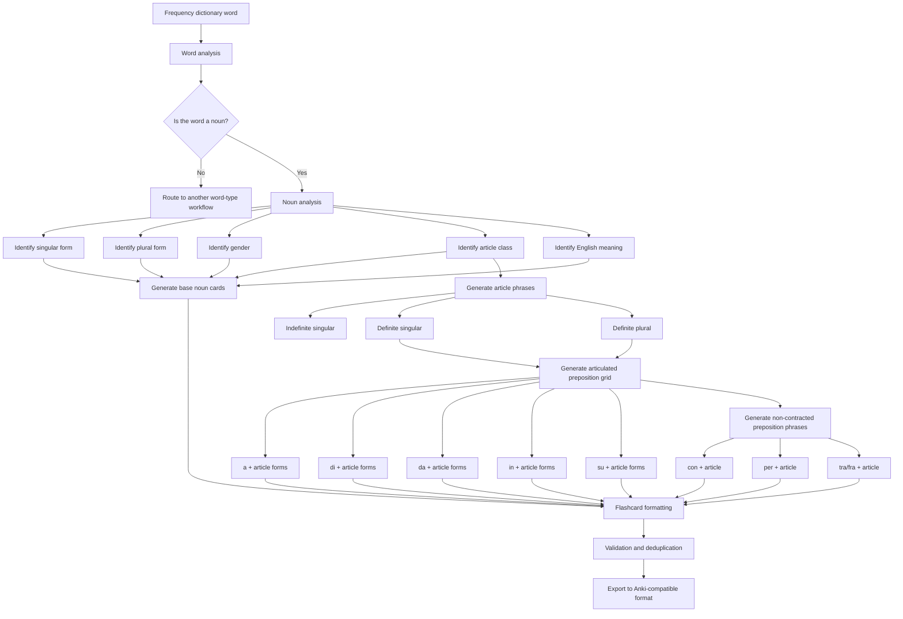

# Italian flashcard generation pipeline

## 1. Project overview

The project is a data-processing and AI-assisted content generation system for creating language-learning flashcard decks.

The first implementation focuses on Italian, but the system should be designed so that the same architecture can later support other languages.

The system starts with a frequency dictionary: a list of words ordered from most frequently used to least frequently used. Each word is processed individually. Depending on the type of word, the system determines what kind of language-learning content should be generated.

For Italian verbs, the system identifies the infinitive form, generates conjugations across key tenses and grammatical persons, and then converts those outputs into flashcard-ready data.

---

## 2. High-level goal

Create a repeatable pipeline that can:

1. Take a frequency-ordered word list.
2. Process each word individually.
3. Identify the word type, such as verb, noun, adjective, adverb, preposition, etc.
4. Apply the appropriate generation workflow for that word type.
5. For verbs, identify the infinitive form.
6. Generate useful conjugation data.
7. Convert the generated language data into structured flashcard decks.
8. Export the final decks for use in Anki or another spaced-repetition system.

---

## 3. Functional diagram



---

## 4. Verb-processing workflow

### 4.1 Input

The input is a single Italian word from the frequency dictionary.

Examples:

* essere
* sono
* avere
* ha
* andare
* vado
* fatto
* mangiare
* mangiato

---

### 4.2 Word classification

The system determines whether the word is a verb.

Possible outcomes:

| Input type      | Example | Action                                                               |
| --------------- | ------: | -------------------------------------------------------------------- |
| Infinitive verb |  andare | Use directly as the infinitive                                       |
| Conjugated verb |    vado | Identify the infinitive: andare                                      |
| Past participle |   fatto | Identify likely infinitive: fare                                     |
| Ambiguous form  |    sono | Resolve likely infinitive: essere, based on context or lexical rules |
| Non-verb        |    casa | Send to non-verb workflow                                            |

---

## 5. Infinitive extraction

If the word is a verb but not an infinitive, the system runs an AI process to identify the infinitive.

### Example

Input word:

> vado

AI output:

> andare

Another example:

Input word:

> ho

AI output:

> avere

Another example:

Input word:

> era

AI output:

> essere

---

## 6. Conjugation generation

Once the infinitive has been identified, the system generates conjugations across selected tenses and grammatical persons.

### Target tenses

The first version should generate the following Italian verb forms:

1. Presente
2. Passato prossimo
3. Presente progressivo
4. Imperativo
5. Imperfetto
6. Futuro semplice
7. Condizionale presente

---

## 7. Grammatical persons

For each tense, the system generates forms for the six standard grammatical persons.

| Person                 | Italian pronoun | English equivalent |
| ---------------------- | --------------- | ------------------ |
| First person singular  | io              | I                  |
| Second person singular | tu              | you                |
| Third person singular  | lui / lei       | he / she / it      |
| First person plural    | noi             | we                 |
| Second person plural   | voi             | you plural         |
| Third person plural    | loro            | they               |

---

## 8. Example output for one verb

For the infinitive:

> parlare

The system would generate a structured output similar to this.

| Tense                 | io           | tu            | lui/lei      | noi             | voi            | loro            |
| --------------------- | ------------ | ------------- | ------------ | --------------- | -------------- | --------------- |
| Presente              | parlo        | parli         | parla        | parliamo        | parlate        | parlano         |
| Passato prossimo      | ho parlato   | hai parlato   | ha parlato   | abbiamo parlato | avete parlato  | hanno parlato   |
| Presente progressivo  | sto parlando | stai parlando | sta parlando | stiamo parlando | state parlando | stanno parlando |
| Imperfetto            | parlavo      | parlavi       | parlava      | parlavamo       | parlavate      | parlavano       |
| Futuro semplice       | parlerò      | parlerai      | parlerà      | parleremo       | parlerete      | parleranno      |
| Condizionale presente | parlerei     | parleresti    | parlerebbe   | parleremmo      | parlereste     | parlerebbero    |

The imperativo is slightly different because it does not naturally use all six persons in the same way as indicative tenses. A practical version could include:

| Person | Imperativo |
| ------ | ---------- |
| tu     | parla      |
| Lei    | parli      |
| noi    | parliamo   |
| voi    | parlate    |
| loro   | parlino    |

For the first version of the system, the imperative may need a special handling rule rather than being treated as a standard six-person tense.

---

## 9. Flashcard generation logic

Once the conjugation table is generated, the system converts each item into one or more flashcards.

### Possible card types

#### Recognition card

Front:

> parlavo

Back:

> I was speaking / I used to speak
> Infinitive: parlare
> Tense: imperfetto
> Person: io

#### Production card

Front:

> How do you say “I was speaking” in Italian?

Back:

> parlavo

#### Infinitive recognition card

Front:

> vado

Back:

> Infinitive: andare
> Meaning: I go / I am going

#### Conjugation prompt card

Front:

> Conjugate parlare in the presente for io.

Back:

> parlo

---

## 10. Recommended data structure

A structured JSON-style output for each verb could look like this:

```json
{
  "source_word": "vado",
  "word_type": "verb",
  "infinitive": "andare",
  "language": "Italian",
  "conjugations": {
    "presente": {
      "io": "vado",
      "tu": "vai",
      "lui_lei": "va",
      "noi": "andiamo",
      "voi": "andate",
      "loro": "vanno"
    },
    "passato_prossimo": {
      "io": "sono andato/andata",
      "tu": "sei andato/andata",
      "lui_lei": "è andato/andata",
      "noi": "siamo andati/andate",
      "voi": "siete andati/andate",
      "loro": "sono andati/andate"
    }
  }
}
```

This structure keeps the system flexible and allows the same source data to be converted into different flashcard formats later.

---

## 11. Quality control requirements

Because AI-generated conjugations can contain errors, the pipeline should include a validation stage.

Recommended validation checks:

1. Confirm the infinitive exists in a dictionary or lexical database.
2. Confirm the tense labels are valid for the target language.
3. Confirm the generated conjugations match a trusted conjugation source where possible.
4. Flag irregular verbs for extra review.
5. Flag ambiguous source words.
6. Flag forms where gender or number affects the answer, such as passato prossimo with essere.
7. Flag defective or unusual verbs.
8. Detect duplicate cards before export.

---

## 12. Special Italian issues to handle

Italian verb generation needs some language-specific rules.

### 12.1 Auxiliary verbs in passato prossimo

Some verbs use avere:

> ho parlato

Some verbs use essere:

> sono andato / sono andata

The system needs to store which auxiliary is used.

### 12.2 Gender and number agreement

With essere verbs, the past participle changes by gender and number:

| Subject             | Example      |
| ------------------- | ------------ |
| io masculine        | sono andato  |
| io feminine         | sono andata  |
| noi masculine/mixed | siamo andati |
| noi feminine        | siamo andate |

The flashcard system needs to decide whether to:

1. Show both masculine and feminine forms.
2. Default to masculine/mixed forms.
3. Generate separate cards for masculine and feminine answers.

### 12.3 Imperativo special handling

Imperativo should not be treated like a normal six-person tense.

Unlike presente, imperfetto, futuro semplice, and condizionale presente, the imperative is used for commands, instructions, requests, warnings, and prohibitions. It also has different behaviour in positive and negative forms.

The system should therefore handle imperativo as a specialised verb workflow.

---

#### 12.3.1 Core principle

For imperativo, the system should only generate cards for forms that are useful, irregular, or meaningfully different from standard predictable patterns.

The goal is not to create unnecessary cards for every possible imperative form. Instead, the system should prioritise forms that a learner is likely to misunderstand, forget, or need in real speech.

---

#### 12.3.2 Imperative persons to include

Italian imperative does not normally use first-person singular.

The useful imperative persons are:

| Person | Use                         | Example with parlare |
| ------ | --------------------------- | -------------------- |
| tu     | informal singular command   | parla                |
| Lei    | formal singular command     | parli                |
| noi    | let’s...                    | parliamo             |
| voi    | informal plural command     | parlate              |
| loro   | formal plural command, rare | parlino              |

The system should usually generate cards for:

1. tu
2. Lei
3. noi
4. voi

The loro imperative should be optional or lower priority because it is rare in everyday use.

---

#### 12.3.3 Positive imperative

Positive imperative forms should be generated where they are useful or deviate from simple expectations.

Examples:

| Infinitive | tu        | Lei    | noi       | voi      |
| ---------- | --------- | ------ | --------- | -------- |
| parlare    | parla     | parli  | parliamo  | parlate  |
| prendere   | prendi    | prenda | prendiamo | prendete |
| dormire    | dormi     | dorma  | dormiamo  | dormite  |
| andare     | vai / va’ | vada   | andiamo   | andate   |
| fare       | fai / fa’ | faccia | facciamo  | fate     |
| essere     | sii       | sia    | siamo     | siate    |
| avere      | abbi      | abbia  | abbiamo   | abbiate  |

Recommended card rule:

* Generate positive imperative cards for irregular verbs.
* Generate positive imperative cards for high-frequency verbs.
* For regular verbs, generate only enough examples to teach the pattern, unless the deck goal is exhaustive generation.

---

#### 12.3.4 Negative imperative

Negative imperative needs separate handling.

For informal tu commands, the negative imperative is usually:

> non + infinitive

Examples:

| Positive tu imperative | Negative tu imperative |
| ---------------------- | ---------------------- |
| parla                  | non parlare            |
| prendere               | non prendere           |
| dormi                  | non dormire            |
| andare                 | non andare             |
| essere                 | non essere             |
| fare                   | non fare               |

Example sentence:

> Non essere difficile.
> Don’t be difficult.

For other persons, the negative imperative generally uses:

> non + imperative/subjunctive-style form

Examples with parlare:

| Person | Negative imperative |
| ------ | ------------------- |
| tu     | non parlare         |
| Lei    | non parli           |
| noi    | non parliamo        |
| voi    | non parlate         |
| loro   | non parlino         |

The system should therefore generate negative imperative separately from positive imperative.

---

#### 12.3.5 Imperative with pronouns

Imperatives often combine with pronouns. These forms are common and useful, but they may create a large number of cards.

Examples:

| Base command | With pronoun | Meaning          |
| ------------ | ------------ | ---------------- |
| dimmi        | di’ + mi     | tell me          |
| dammi        | da’ + mi     | give me          |
| fammi        | fa’ + mi     | let me / make me |
| ascoltami    | ascolta + mi | listen to me     |
| guardalo     | guarda + lo  | look at it/him   |
| prendilo     | prendi + lo  | take it          |
| aiutami      | aiuta + mi   | help me          |

Special doubled-consonant forms occur with some short irregular imperatives:

| Verb   | Imperative + pronoun | Meaning           |
| ------ | -------------------- | ----------------- |
| dire   | dimmi                | tell me           |
| dare   | dammi                | give me           |
| fare   | fammi                | let me / make me  |
| stare  | stammi               | stay / be with me |
| andare | vacci                | go there          |

Recommended card rule:

* Include pronoun-attached imperatives only for high-frequency, high-value phrases.
* Treat them as phrase cards rather than full-table conjugation cards.
* Prioritise common chunks like dimmi, dammi, fammi, aiutami, ascoltami, guardalo, prendilo, and vieni.

---

#### 12.3.6 Negative imperative with pronouns

Negative imperatives can place pronouns either before or after the verb in some cases, especially with tu.

Examples:

| Form           | Meaning       |
| -------------- | ------------- |
| non mi dire    | don’t tell me |
| non dirmi      | don’t tell me |
| non lo fare    | don’t do it   |
| non farlo      | don’t do it   |
| non mi aiutare | don’t help me |
| non aiutarmi   | don’t help me |

Recommended card rule:

* For the first version, generate only the simpler, more transparent form.
* Prefer non + infinitive + attached pronoun for tu forms where appropriate, such as non farlo.
* Add alternate accepted forms as notes rather than separate cards unless they are common.

---

#### 12.3.7 Imperative card types

Imperativo should generate different card types from ordinary tense cards.

Recommended cards:

| Card type            | Front                                      | Back         |
| -------------------- | ------------------------------------------ | ------------ |
| Positive command     | Tell one person informally: “Speak!”       | Parla!       |
| Negative command     | Tell one person informally: “Don’t speak!” | Non parlare! |
| Formal command       | Tell someone formally: “Speak!”            | Parli!       |
| Let’s form           | Say: “Let’s speak.”                        | Parliamo.    |
| Irregular command    | Informal command: “Be good.”               | Sii bravo/a. |
| Phrase card          | “Tell me!”                                 | Dimmi!       |
| Negative phrase card | “Don’t do it!”                             | Non farlo!   |

---

#### 12.3.8 Imperativo generation rules

Recommended system rules:

1. Do not generate an io imperative card.
2. Generate tu, Lei, noi, and voi forms.
3. Make loro optional or advanced.
4. Generate negative imperative forms separately.
5. For regular verbs, generate only high-frequency or pattern-teaching examples.
6. For irregular verbs, generate cards more aggressively.
7. For high-frequency verbs, generate both positive and negative imperatives.
8. For pronoun-attached forms, generate only common phrase-based cards.
9. Flag irregular imperative forms for review.
10. Store imperative cards separately from normal tense/person cards.

---

#### 12.3.9 Suggested data structure for imperativo

```json
{
  "infinitive": "essere",
  "imperativo": {
    "positive": {
      "tu": "sii",
      "Lei": "sia",
      "noi": "siamo",
      "voi": "siate",
      "loro": "siano"
    },
    "negative": {
      "tu": "non essere",
      "Lei": "non sia",
      "noi": "non siamo",
      "voi": "non siate",
      "loro": "non siano"
    },
    "noteworthy_forms": [
      "sii",
      "non essere",
      "sia",
      "siate"
    ],
    "phrase_cards": [
      {
        "front": "Don't be difficult.",
        "back": "Non essere difficile."
      },
      {
        "front": "Be good.",
        "back": "Sii bravo/a."
      }
    ]
  }
}
```

---

#### 12.3.10 Recommended MVP handling for imperativo

For the minimum viable version, imperativo should generate:

1. Positive tu form, only if irregular or high-frequency.
2. Negative tu form.
3. Formal Lei form, if common or useful.
4. Voi form, if high-frequency or classroom/useful instruction language.
5. Common phrase cards for irregular imperatives.

Examples of high-value imperative verbs:

* essere: sii, non essere
* avere: abbi, non avere
* fare: fa’ / fai, non fare, fammi, non farlo
* dire: di’, dimmi, non dire, non dirmi
* dare: da’ / dai, dammi, non dare
* andare: va’ / vai, vai, non andare, vacci
* stare: sta’ / stai, stai, non stare
* venire: vieni, non venire
* guardare: guarda, non guardare
* ascoltare: ascolta, non ascoltare
* prendere: prendi, non prendere
* lasciare: lascia, non lasciare

### 12.4 Ambiguous word forms

Some Italian forms can map to multiple possible infinitives or grammatical functions.

Example:

> sono

Possible interpretations:

* essere, io sono
* essere, loro sono

The system should either:

1. Store all valid interpretations.
2. Choose the most likely interpretation based on frequency.
3. Create multiple cards.
4. Flag the item for manual review.

---

## 13. Proposed pipeline stages

### Stage 1: Input preparation

* Import frequency dictionary.
* Clean data.
* Remove duplicates.
* Normalise casing.
* Store rank and frequency metadata.

### Stage 2: Word analysis

* Identify word type.
* Detect whether word is a verb.
* Detect whether verb is infinitive or conjugated.

### Stage 3: Infinitive resolution

* For infinitive verbs, pass through unchanged.
* For conjugated verbs, identify infinitive.
* Store confidence score.
* Flag ambiguity.

### Stage 4: Verb generation

* Generate conjugations for target tenses.
* Generate six-person conjugation tables where applicable.
* Apply Italian-specific rules for auxiliary verbs, agreement, and imperatives.

### Stage 5: Validation

* Check against trusted grammar/conjugation sources.
* Validate tense/person completeness.
* Flag irregular or ambiguous outputs.

### Stage 6: Flashcard transformation

* Convert conjugation data into flashcard rows.
* Generate front text.
* Generate back text.
* Add metadata fields.
* Add tags.

### Stage 7: Export

* Export to CSV, TSV, JSON, or Anki package format.
* Preserve metadata so cards can be filtered by frequency, tense, verb type, difficulty, or irregularity.

---

## 14. Flashcard structure and rendering rules

Each generated flashcard has two sides:

1. Front side
2. Back side

The system should support bidirectional cards. For every Italian-to-English card, there should be a matching English-to-Italian card.

---

### 14.1 Core card behaviour

The flashcard should behave as a reveal card, not a full replacement card.

When the card first appears, it shows the front content.

When the learner checks or flips the card, the back content appears underneath the original front content. The original front content remains visible.

This means the learner sees:

1. The prompt content first.
2. Then the answer content added below it.
3. Any image remains visible after the card is flipped.

---

### 14.2 Italian-to-English card layout

For Italian-to-English cards, the front side shows:

* Italian word or phrase
* Image, where available
* Audio track that plays when the card appears
* Small labels, where relevant

After the card is flipped, the back side appears underneath and shows:

* English meaning
* Additional labels or grammar information, where relevant

Example:

#### Front before reveal

Italian:

> parliamo

Audio:

> Plays automatically when card appears

Labels:

> presente
> noi
> verb

#### After reveal

Italian:

> parliamo

English:

> we speak / we are speaking

Labels:

> presente
> noi
> verb

---

### 14.3 English-to-Italian card layout

For English-to-Italian cards, the front side shows:

* English word or phrase
* Image, where available
* Small labels, where relevant

After the card is flipped, the back side appears underneath and shows:

* Italian word or phrase
* Audio track
* Additional labels or grammar information, where relevant

Example:

#### Front before reveal

English:

> we speak / we are speaking

Labels:

> presente
> noi
> verb

#### After reveal

English:

> we speak / we are speaking

Italian:

> parliamo

Audio:

> Available or played on reveal

Labels:

> presente
> noi
> verb

---

### 14.4 Persistent image behaviour

Images should remain visible on both sides of the card.

The image should not disappear when the card is flipped.

The image can be used for:

* nouns
* concrete verbs
* adjectives
* phrase cards
* common objects
* places
* actions

For abstract words, the image field may be empty or replaced with an icon/visual cue if appropriate.

---

### 14.5 Audio behaviour

For Italian-to-English cards:

* Audio should play when the card first appears.
* The audio should correspond to the Italian word or phrase shown on the front.

For English-to-Italian cards:

* Audio may play after reveal, because the learner should attempt to recall the Italian before hearing it.
* The audio should correspond to the Italian answer.

This prevents the audio from giving away the answer on English-to-Italian production cards.

---

### 14.6 Labels on cards

Cards should support small visible labels.

Labels help the learner understand what kind of card they are looking at without needing long explanations.

Labels may include:

* word type
* tense
* grammatical person
* gender
* number
* article type
* preposition
* register
* irregularity
* frequency band
* deck category

Examples:

| Card content | Possible labels                             |
| ------------ | ------------------------------------------- |
| parliamo     | verb, presente, noi                         |
| parlavo      | verb, imperfetto, io                        |
| non parlare  | verb, imperativo, negative, tu              |
| il cane      | noun, masculine, singular, definite article |
| i cani       | noun, masculine, plural, definite article   |
| alla casa    | noun, feminine, singular, a + la            |
| delle case   | noun, feminine, plural, di + le             |

---

### 14.7 Verb card labels

Verb cards should include labels for:

1. Word type
2. Tense or mood
3. Person
4. Number, where useful
5. Polarity, for negative forms
6. Register, where useful
7. Irregularity, where useful

Example:

For:

> parliamo

Labels:

* verb
* presente
* noi

For:

> non essere

Labels:

* verb
* imperativo
* negative
* tu

For:

> sia

Labels:

* verb
* imperativo
* formal
* Lei
* irregular

---

### 14.8 Noun card labels

Noun cards should include labels for:

1. Word type
2. Gender
3. Number
4. Article type
5. Preposition, where applicable
6. Irregularity, where useful

Example:

For:

> il cane

Labels:

* noun
* masculine
* singular
* definite article

For:

> i cani

Labels:

* noun
* masculine
* plural
* definite article

For:

> alla casa

Labels:

* noun
* feminine
* singular
* articulated preposition
* a + la

---

### 14.9 Bidirectional card generation

Every generated flashcard should have a matching reverse-direction card.

That means each language item produces at least two cards:

1. Italian to English
2. English to Italian

Example pair:

| Direction          | Front                      | Back                       |
| ------------------ | -------------------------- | -------------------------- |
| Italian to English | parliamo                   | we speak / we are speaking |
| English to Italian | we speak / we are speaking | parliamo                   |

The reverse card should preserve relevant metadata, labels, images, and audio settings.

However, audio behaviour may differ by direction:

| Direction          | Audio behaviour                                                          |
| ------------------ | ------------------------------------------------------------------------ |
| Italian to English | Play Italian audio on card appearance                                    |
| English to Italian | Do not play Italian audio before reveal; play or show audio after reveal |

---

### 14.10 One-to-one card mapping

The system should maintain a one-to-one relationship between forward and reverse cards.

Each generated card should have:

* a unique card ID
* a pair ID linking it to its reverse card
* a direction field
* shared source metadata

Example:

```json
{
  "card_id": "it-verb-parlare-presente-noi-forward",
  "pair_id": "it-verb-parlare-presente-noi",
  "direction": "italian_to_english",
  "front": {
    "text": "parliamo",
    "language": "Italian",
    "audio": "parliamo.mp3",
    "image": null,
    "labels": ["verb", "presente", "noi"]
  },
  "back": {
    "text": "we speak / we are speaking",
    "language": "English",
    "labels": ["verb", "presente", "noi"]
  }
}
```

Matching reverse card:

```json
{
  "card_id": "it-verb-parlare-presente-noi-reverse",
  "pair_id": "it-verb-parlare-presente-noi",
  "direction": "english_to_italian",
  "front": {
    "text": "we speak / we are speaking",
    "language": "English",
    "image": null,
    "labels": ["verb", "presente", "noi"]
  },
  "back": {
    "text": "parliamo",
    "language": "Italian",
    "audio": "parliamo.mp3",
    "labels": ["verb", "presente", "noi"]
  }
}
```

---

## 15. Suggested deck structure

The system could generate several different decks or subdecks.

### Option A: By frequency band

* Italian verbs 1–500
* Italian verbs 501–1000
* Italian verbs 1001–2000

### Option B: By tense

* Italian verbs: presente
* Italian verbs: passato prossimo
* Italian verbs: imperfetto
* Italian verbs: futuro semplice
* Italian verbs: condizionale presente

### Option C: By learning task

* Recognise conjugated forms
* Produce conjugated forms
* Identify infinitives
* Translate example sentences

### Option D: Combined structure

Example:

* Italian::Verbs::Top 500::Presente
* Italian::Verbs::Top 500::Passato prossimo
* Italian::Verbs::Top 500::Imperfetto
* Italian::Verbs::Top 500::Infinitive recognition

---

## 15. Minimum viable version

The simplest useful version of the project could be:

1. Input: top 500 Italian words.
2. Detect verbs only.
3. Identify infinitives.
4. Generate conjugations for:

   * presente
   * passato prossimo
   * imperfetto
5. Generate recognition and production cards.
6. Export to Anki-compatible CSV.
7. Manually review flagged irregular or ambiguous verbs.

---

## 16. Noun-processing workflow

Nouns are the next major workflow after verbs.

Unlike verbs, where one infinitive generates conjugation tables, a noun generates a set of article, plural, and preposition/article combination cards.

The goal is to help the learner recognise and produce the noun in realistic Italian noun phrases, not just memorise the bare dictionary form.

---

### 16.1 Noun input

The input is a single Italian noun from the frequency dictionary.

Examples:

* cane
* casa
* libro
* ragazza
* uomo
* amico
* scuola
* città

---

### 16.2 Noun analysis

For each noun, the system needs to identify:

1. Singular form
2. Plural form
3. Gender
4. Whether it begins with a vowel
5. Whether it requires lo / gli forms
6. Whether it is invariant in the plural
7. Whether it has irregular plural behaviour
8. English meaning

Example:

| Field               | Example   |
| ------------------- | --------- |
| Source word         | cane      |
| Singular            | cane      |
| Plural              | cani      |
| Gender              | masculine |
| English meaning     | dog       |
| Definite singular   | il cane   |
| Definite plural     | i cani    |
| Indefinite singular | un cane   |

---

## 17. Noun flashcard generation

Each noun should generate multiple flashcards.

The core noun cards are:

1. Bare singular form
2. Bare plural form
3. Singular with indefinite article
4. Singular with definite article
5. Plural with definite article
6. English-to-Italian production card
7. Italian-to-English recognition card
8. Gender recognition card
9. Article selection card
10. Articulated preposition cards

---

### 17.1 Basic noun cards

For the noun:

> cane

The system could generate:

| Card type            | Front                       | Back      |
| -------------------- | --------------------------- | --------- |
| Singular recognition | cane                        | dog       |
| Plural production    | What is the plural of cane? | cani      |
| Indefinite article   | a dog                       | un cane   |
| Definite singular    | the dog                     | il cane   |
| Definite plural      | the dogs                    | i cani    |
| Gender               | What gender is cane?        | Masculine |

---

### 17.2 Articles to generate

The system should generate article-based noun phrases.

#### Indefinite articles

| Gender / noun type                                    | Italian article | Example      |
| ----------------------------------------------------- | --------------- | ------------ |
| Masculine standard                                    | un              | un cane      |
| Masculine before z, s + consonant, gn, ps, x, y, etc. | uno             | uno studente |
| Feminine before consonant                             | una             | una casa     |
| Feminine before vowel                                 | un’             | un’amica     |

#### Definite articles

| Gender / noun type                                    | Singular | Plural | Example                    |
| ----------------------------------------------------- | -------- | ------ | -------------------------- |
| Masculine standard                                    | il       | i      | il cane / i cani           |
| Masculine before z, s + consonant, gn, ps, x, y, etc. | lo       | gli    | lo studente / gli studenti |
| Masculine before vowel                                | l’       | gli    | l’amico / gli amici        |
| Feminine before consonant                             | la       | le     | la casa / le case          |
| Feminine before vowel                                 | l’       | le     | l’amica / le amiche        |

---

## 18. Articulated preposition generation

Italian combines many common prepositions with definite articles.

The system should generate these combinations for each noun in both singular and plural where appropriate.

Core prepositions to include:

1. a
2. di
3. da
4. in
5. con
6. su
7. per
8. tra / fra

Some prepositions form mandatory contractions with definite articles. Others often remain separate.

---

### 18.1 Main articulated preposition grid

The core grid should be generated from the noun’s correct definite article.

| Preposition | il  | lo    | l’    | la    | i   | gli   | le    |
| ----------- | --- | ----- | ----- | ----- | --- | ----- | ----- |
| a           | al  | allo  | all’  | alla  | ai  | agli  | alle  |
| di          | del | dello | dell’ | della | dei | degli | delle |
| da          | dal | dallo | dall’ | dalla | dai | dagli | dalle |
| in          | nel | nello | nell’ | nella | nei | negli | nelle |
| su          | sul | sullo | sull’ | sulla | sui | sugli | sulle |

For a noun like cane, the system should generate:

| Meaning       | Italian  |
| ------------- | -------- |
| to the dog    | al cane  |
| of the dog    | del cane |
| from the dog  | dal cane |
| in the dog    | nel cane |
| on the dog    | sul cane |
| to the dogs   | ai cani  |
| of the dogs   | dei cani |
| from the dogs | dai cani |
| in the dogs   | nei cani |
| on the dogs   | sui cani |

---

### 18.2 Non-contracted preposition cards

Some common prepositions usually do not contract with articles in modern standard Italian.

These can still be generated as phrase cards.

| Preposition | Singular example | Plural example |
| ----------- | ---------------- | -------------- |
| con         | con il cane      | con i cani     |
| per         | per il cane      | per i cani     |
| tra         | tra il cane      | tra i cani     |
| fra         | fra il cane      | fra i cani     |

Optional note: older or literary forms like col, coi, pel, pei may exist, but they should probably be excluded from the first version unless the goal is comprehensive recognition.

---

## 19. Noun workflow diagram



---

## 20. Example noun output

For the noun:

> casa

The system may generate a structured output like this:

```json
{
  "source_word": "casa",
  "word_type": "noun",
  "language": "Italian",
  "english": "house",
  "gender": "feminine",
  "singular": "casa",
  "plural": "case",
  "articles": {
    "indefinite_singular": "una casa",
    "definite_singular": "la casa",
    "definite_plural": "le case"
  },
  "articulated_prepositions": {
    "singular": {
      "a": "alla casa",
      "di": "della casa",
      "da": "dalla casa",
      "in": "nella casa",
      "su": "sulla casa"
    },
    "plural": {
      "a": "alle case",
      "di": "delle case",
      "da": "dalle case",
      "in": "nelle case",
      "su": "sulle case"
    }
  },
  "non_contracted_prepositions": {
    "singular": {
      "con": "con la casa",
      "per": "per la casa",
      "tra": "tra la casa",
      "fra": "fra la casa"
    },
    "plural": {
      "con": "con le case",
      "per": "per le case",
      "tra": "tra le case",
      "fra": "fra le case"
    }
  }
}
```

---

## 21. Noun-specific quality control

Noun outputs need validation because Italian noun rules have many edge cases.

The system should check:

1. Gender is correct.
2. Plural is correct.
3. Definite article is correct.
4. Indefinite article is correct.
5. Apostrophes are handled correctly.
6. Masculine lo/gli nouns are detected correctly.
7. Invariant nouns are handled correctly.
8. Irregular plurals are flagged.
9. Ambiguous nouns are flagged.
10. Articulated prepositions are generated from the correct article.

Examples of edge cases:

| Noun     | Issue                                                                               |
| -------- | ----------------------------------------------------------------------------------- |
| uomo     | irregular plural: uomini                                                            |
| città    | invariant plural: città                                                             |
| amico    | plural spelling change: amici                                                       |
| studente | masculine but uses lo/gli pattern in some phrases only if required by sound pattern |
| problema | masculine despite ending in -a                                                      |
| mano     | feminine despite ending in -o                                                       |
| uovo     | masculine singular, feminine plural in some traditional grammar contexts: le uova   |

---

## 22. Future expansion

This project creates a generalisable language-learning pipeline that starts with frequency-ranked words and produces structured flashcard decks.

For Italian verbs, the core workflow is:

1. Take a word from the frequency dictionary.
2. Determine whether it is a verb.
3. If it is a conjugated verb, identify the infinitive.
4. Generate conjugations across key tenses.
5. Generate forms for the relevant grammatical persons.
6. Validate the output.
7. Transform the output into flashcards.
8. Export the flashcards for spaced-repetition learning.

The first version should focus on verbs because they provide a clear, high-value workflow. Once the verb workflow is stable, the same system can be extended to nouns, adjectives, prepositions, pronouns, and other word classes.
