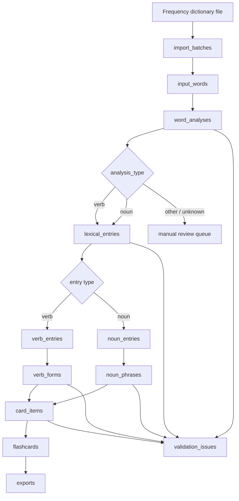
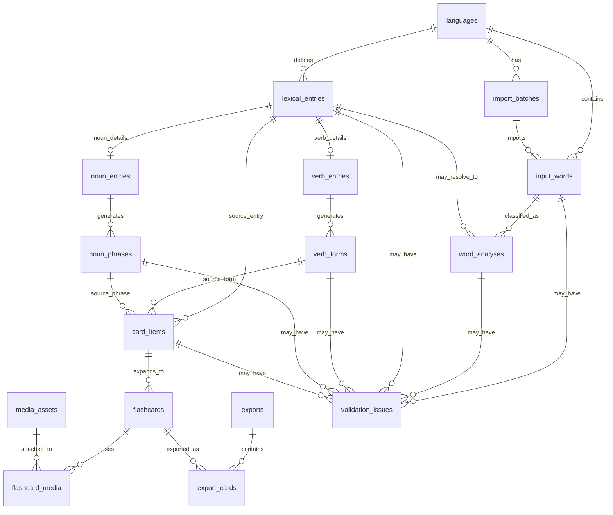

# Italian Flashcards Implementation Plan

Build a repeatable pipeline that turns frequency-ranked Italian words into validated language data and Anki-ready flashcards. The MVP focuses on Italian verbs and nouns, but the schema is intentionally general enough to add adjectives, adverbs, phrases, and other languages later.

## MVP Scope

1. Import a frequency dictionary.
2. Store every raw source word once.
3. Classify each word into one or more possible analyses.
4. Resolve verb infinitives and noun base forms.
5. Generate structured language forms:
   - verbs: tense/person conjugations and selected imperatives
   - nouns: singular/plural, articles, and preposition/article phrases
6. Validate generated data and flag uncertain output.
7. Generate bidirectional flashcards.
8. Export to Anki-compatible CSV first; `.apkg` can come later.

## Pipeline



## Core Data Model

Separate the source word from the final language item.

- `input_words` stores the raw word from the frequency list.
- `word_analyses` stores every possible interpretation of that word.
- `lexical_entries` stores normalized dictionary entries such as `andare`, `casa`, or `bene`.
- Type-specific tables store details for verbs, nouns, and future word classes.
- Generated form tables store concrete studyable outputs.
- `card_items` stores one study unit before direction expansion.
- `flashcards` stores the actual forward/reverse cards.

Example: `ballo` can become two analyses:

| Input word | Analysis | Lexical entry | Meaning |
| --- | --- | --- | --- |
| ballo | noun | ballo | dance / ball |
| ballo | verb | ballare | I dance |

## Entity Relationship Diagram



## Processing Status Values

Use controlled strings. Do not invent new statuses inside application code.

| Field | Allowed values |
| --- | --- |
| processing status | `pending`, `processing`, `complete`, `failed`, `needs_review`, `skipped` |
| validation status | `unvalidated`, `valid`, `warning`, `invalid`, `needs_review` |
| source type | `frequency_dictionary`, `manual`, `ai_generated`, `rule_generated`, `validated_source` |
| card direction | `it_to_en`, `en_to_it` |
| card state | `draft`, `ready`, `suspended`, `exported` |

## SQLite Schema

Enable foreign keys at connection startup:

```sql
PRAGMA foreign_keys = ON;
```

### 1. Languages

```sql
CREATE TABLE languages (
    id INTEGER PRIMARY KEY AUTOINCREMENT,
    code TEXT NOT NULL UNIQUE,              -- it, en
    name TEXT NOT NULL,                     -- Italian, English
    created_at TEXT NOT NULL DEFAULT CURRENT_TIMESTAMP,
    updated_at TEXT NOT NULL DEFAULT CURRENT_TIMESTAMP
);
```

### 2. Import Batches

Tracks each frequency-list import.

```sql
CREATE TABLE import_batches (
    id INTEGER PRIMARY KEY AUTOINCREMENT,
    language_id INTEGER NOT NULL,
    name TEXT NOT NULL,
    source_file TEXT,
    source_description TEXT,
    imported_at TEXT NOT NULL DEFAULT CURRENT_TIMESTAMP,
    row_count INTEGER NOT NULL DEFAULT 0,
    notes TEXT,
    FOREIGN KEY (language_id) REFERENCES languages(id) ON DELETE RESTRICT
);

CREATE INDEX idx_import_batches_language_id ON import_batches(language_id);
```

### 3. Input Words

One row per raw frequency-list item per import batch.

```sql
CREATE TABLE input_words (
    id INTEGER PRIMARY KEY AUTOINCREMENT,
    language_id INTEGER NOT NULL,
    import_batch_id INTEGER,
    surface_word TEXT NOT NULL,             -- original spelling from file
    normalized_word TEXT NOT NULL,          -- lowercased / trimmed canonical form
    frequency_rank INTEGER,
    frequency_value REAL,
    source_row_number INTEGER,
    processing_status TEXT NOT NULL DEFAULT 'pending'
        CHECK (processing_status IN ('pending', 'processing', 'complete', 'failed', 'needs_review', 'skipped')),
    created_at TEXT NOT NULL DEFAULT CURRENT_TIMESTAMP,
    updated_at TEXT NOT NULL DEFAULT CURRENT_TIMESTAMP,
    UNIQUE (language_id, import_batch_id, normalized_word),
    FOREIGN KEY (language_id) REFERENCES languages(id) ON DELETE RESTRICT,
    FOREIGN KEY (import_batch_id) REFERENCES import_batches(id) ON DELETE SET NULL
);

CREATE INDEX idx_input_words_language_rank ON input_words(language_id, frequency_rank);
CREATE INDEX idx_input_words_normalized_word ON input_words(normalized_word);
CREATE INDEX idx_input_words_processing_status ON input_words(processing_status);
```

### 4. Word Analyses

Multiple analyses can belong to one input word.

```sql
CREATE TABLE word_analyses (
    id INTEGER PRIMARY KEY AUTOINCREMENT,
    input_word_id INTEGER NOT NULL,
    lexical_entry_id INTEGER,
    analysis_type TEXT NOT NULL
        CHECK (analysis_type IN ('verb', 'noun', 'adjective', 'adverb', 'preposition', 'article', 'pronoun', 'conjunction', 'interjection', 'numeral', 'determiner', 'phrase', 'unknown')),
    surface_role TEXT,                      -- infinitive, conjugated_form, singular_noun, plural_noun, article, etc.
    lemma TEXT,                             -- best resolved dictionary form
    confidence REAL CHECK (confidence IS NULL OR (confidence >= 0 AND confidence <= 1)),
    is_primary INTEGER NOT NULL DEFAULT 0 CHECK (is_primary IN (0, 1)),
    is_ambiguous INTEGER NOT NULL DEFAULT 0 CHECK (is_ambiguous IN (0, 1)),
    needs_review INTEGER NOT NULL DEFAULT 0 CHECK (needs_review IN (0, 1)),
    explanation TEXT,
    raw_ai_response TEXT,
    created_at TEXT NOT NULL DEFAULT CURRENT_TIMESTAMP,
    updated_at TEXT NOT NULL DEFAULT CURRENT_TIMESTAMP,
    FOREIGN KEY (input_word_id) REFERENCES input_words(id) ON DELETE CASCADE,
    FOREIGN KEY (lexical_entry_id) REFERENCES lexical_entries(id) ON DELETE SET NULL
);

CREATE INDEX idx_word_analyses_input_word_id ON word_analyses(input_word_id);
CREATE INDEX idx_word_analyses_lexical_entry_id ON word_analyses(lexical_entry_id);
CREATE INDEX idx_word_analyses_type ON word_analyses(analysis_type);
CREATE INDEX idx_word_analyses_review ON word_analyses(needs_review, is_ambiguous);
```

### 5. Lexical Entries

Normalized dictionary-level language items.

```sql
CREATE TABLE lexical_entries (
    id INTEGER PRIMARY KEY AUTOINCREMENT,
    language_id INTEGER NOT NULL,
    lemma TEXT NOT NULL,                    -- parlare, casa, bene
    normalized_lemma TEXT NOT NULL,
    entry_type TEXT NOT NULL
        CHECK (entry_type IN ('verb', 'noun', 'adjective', 'adverb', 'preposition', 'article', 'pronoun', 'conjunction', 'interjection', 'numeral', 'determiner', 'phrase', 'unknown')),
    english_gloss TEXT,
    frequency_rank_min INTEGER,             -- best rank among source words that map here
    frequency_band TEXT,                    -- top_500, top_1000, etc.
    source_type TEXT NOT NULL DEFAULT 'ai_generated'
        CHECK (source_type IN ('frequency_dictionary', 'manual', 'ai_generated', 'rule_generated', 'validated_source')),
    validation_status TEXT NOT NULL DEFAULT 'unvalidated'
        CHECK (validation_status IN ('unvalidated', 'valid', 'warning', 'invalid', 'needs_review')),
    notes TEXT,
    created_at TEXT NOT NULL DEFAULT CURRENT_TIMESTAMP,
    updated_at TEXT NOT NULL DEFAULT CURRENT_TIMESTAMP,
    UNIQUE (language_id, normalized_lemma, entry_type),
    FOREIGN KEY (language_id) REFERENCES languages(id) ON DELETE RESTRICT
);

CREATE INDEX idx_lexical_entries_language_type ON lexical_entries(language_id, entry_type);
CREATE INDEX idx_lexical_entries_normalized_lemma ON lexical_entries(normalized_lemma);
CREATE INDEX idx_lexical_entries_validation_status ON lexical_entries(validation_status);
```

### 6. Verb Entries

One row per verb lexical entry.

```sql
CREATE TABLE verb_entries (
    id INTEGER PRIMARY KEY AUTOINCREMENT,
    lexical_entry_id INTEGER NOT NULL UNIQUE,
    infinitive TEXT NOT NULL,
    infinitive_ending TEXT CHECK (infinitive_ending IN ('are', 'ere', 'ire', 'other')),
    auxiliary TEXT CHECK (auxiliary IN ('avere', 'essere', 'both', 'unknown')),
    past_participle TEXT,
    gerund TEXT,
    is_regular INTEGER NOT NULL DEFAULT 0 CHECK (is_regular IN (0, 1)),
    is_reflexive INTEGER NOT NULL DEFAULT 0 CHECK (is_reflexive IN (0, 1)),
    is_modal INTEGER NOT NULL DEFAULT 0 CHECK (is_modal IN (0, 1)),
    is_defective INTEGER NOT NULL DEFAULT 0 CHECK (is_defective IN (0, 1)),
    conjugation_notes TEXT,
    FOREIGN KEY (lexical_entry_id) REFERENCES lexical_entries(id) ON DELETE CASCADE
);

CREATE INDEX idx_verb_entries_infinitive ON verb_entries(infinitive);
CREATE INDEX idx_verb_entries_auxiliary ON verb_entries(auxiliary);
```

### 7. Verb Forms

Concrete conjugated forms. Normal tenses use six persons where applicable. Imperatives use only valid command persons.

```sql
CREATE TABLE verb_forms (
    id INTEGER PRIMARY KEY AUTOINCREMENT,
    verb_entry_id INTEGER NOT NULL,
    mood TEXT NOT NULL,                     -- indicativo, imperativo, condizionale, gerundio, participio
    tense TEXT NOT NULL,                    -- presente, passato_prossimo, imperfetto, futuro_semplice, etc.
    person TEXT,                            -- io, tu, lui_lei, noi, voi, loro, Lei
    number TEXT CHECK (number IS NULL OR number IN ('singular', 'plural')),
    gender TEXT CHECK (gender IS NULL OR gender IN ('masculine', 'feminine', 'mixed', 'invariable')),
    polarity TEXT NOT NULL DEFAULT 'positive' CHECK (polarity IN ('positive', 'negative')),
    register TEXT CHECK (register IS NULL OR register IN ('informal', 'formal', 'neutral')),
    form_text TEXT NOT NULL,                -- parlo, sono andato, non parlare
    english_gloss TEXT,
    generation_source TEXT NOT NULL DEFAULT 'ai_generated'
        CHECK (generation_source IN ('manual', 'ai_generated', 'rule_generated', 'validated_source')),
    validation_status TEXT NOT NULL DEFAULT 'unvalidated'
        CHECK (validation_status IN ('unvalidated', 'valid', 'warning', 'invalid', 'needs_review')),
    is_irregular INTEGER NOT NULL DEFAULT 0 CHECK (is_irregular IN (0, 1)),
    needs_review INTEGER NOT NULL DEFAULT 0 CHECK (needs_review IN (0, 1)),
    notes TEXT,
    created_at TEXT NOT NULL DEFAULT CURRENT_TIMESTAMP,
    updated_at TEXT NOT NULL DEFAULT CURRENT_TIMESTAMP,
    FOREIGN KEY (verb_entry_id) REFERENCES verb_entries(id) ON DELETE CASCADE,
    UNIQUE (verb_entry_id, mood, tense, person, number, gender, polarity, register, form_text)
);

CREATE INDEX idx_verb_forms_verb_entry_id ON verb_forms(verb_entry_id);
CREATE INDEX idx_verb_forms_tense_person ON verb_forms(tense, person);
CREATE INDEX idx_verb_forms_validation_status ON verb_forms(validation_status);
```

### 8. Noun Entries

One row per noun lexical entry.

```sql
CREATE TABLE noun_entries (
    id INTEGER PRIMARY KEY AUTOINCREMENT,
    lexical_entry_id INTEGER NOT NULL UNIQUE,
    singular TEXT NOT NULL,
    plural TEXT,
    gender TEXT NOT NULL CHECK (gender IN ('masculine', 'feminine', 'both', 'unknown')),
    is_invariant_plural INTEGER NOT NULL DEFAULT 0 CHECK (is_invariant_plural IN (0, 1)),
    is_irregular_plural INTEGER NOT NULL DEFAULT 0 CHECK (is_irregular_plural IN (0, 1)),
    starts_with_vowel INTEGER NOT NULL DEFAULT 0 CHECK (starts_with_vowel IN (0, 1)),
    article_class_singular TEXT CHECK (article_class_singular IN ('il', 'lo', 'l', 'la', 'unknown')),
    article_class_plural TEXT CHECK (article_class_plural IN ('i', 'gli', 'le', 'unknown')),
    indefinite_article TEXT CHECK (indefinite_article IS NULL OR indefinite_article IN ('un', 'uno', 'una', 'un_apostrophe')),
    english_gloss TEXT,
    notes TEXT,
    FOREIGN KEY (lexical_entry_id) REFERENCES lexical_entries(id) ON DELETE CASCADE
);

CREATE INDEX idx_noun_entries_singular ON noun_entries(singular);
CREATE INDEX idx_noun_entries_gender ON noun_entries(gender);
CREATE INDEX idx_noun_entries_article_classes ON noun_entries(article_class_singular, article_class_plural);
```

### 9. Noun Phrases

Generated noun study items: bare forms, article forms, and preposition phrases.

```sql
CREATE TABLE noun_phrases (
    id INTEGER PRIMARY KEY AUTOINCREMENT,
    noun_entry_id INTEGER NOT NULL,
    phrase_type TEXT NOT NULL
        CHECK (phrase_type IN ('bare', 'indefinite_article', 'definite_article', 'articulated_preposition', 'preposition_phrase')),
    grammatical_number TEXT NOT NULL CHECK (grammatical_number IN ('singular', 'plural')),
    article TEXT,                           -- il, i, la, le, gli, etc.
    preposition TEXT,                       -- a, di, da, in, su, con, per, tra, fra
    contracted_form TEXT,                   -- al, della, sugli, etc.
    phrase_text TEXT NOT NULL,              -- alla casa
    english_gloss TEXT,
    generation_source TEXT NOT NULL DEFAULT 'rule_generated'
        CHECK (generation_source IN ('manual', 'ai_generated', 'rule_generated', 'validated_source')),
    validation_status TEXT NOT NULL DEFAULT 'unvalidated'
        CHECK (validation_status IN ('unvalidated', 'valid', 'warning', 'invalid', 'needs_review')),
    needs_review INTEGER NOT NULL DEFAULT 0 CHECK (needs_review IN (0, 1)),
    notes TEXT,
    created_at TEXT NOT NULL DEFAULT CURRENT_TIMESTAMP,
    updated_at TEXT NOT NULL DEFAULT CURRENT_TIMESTAMP,
    FOREIGN KEY (noun_entry_id) REFERENCES noun_entries(id) ON DELETE CASCADE,
    UNIQUE (noun_entry_id, phrase_type, grammatical_number, article, preposition, phrase_text)
);

CREATE INDEX idx_noun_phrases_noun_entry_id ON noun_phrases(noun_entry_id);
CREATE INDEX idx_noun_phrases_type ON noun_phrases(phrase_type);
CREATE INDEX idx_noun_phrases_validation_status ON noun_phrases(validation_status);
```

### 10. Card Items

A card item is one studyable fact before creating forward and reverse flashcards.

```sql
CREATE TABLE card_items (
    id INTEGER PRIMARY KEY AUTOINCREMENT,
    lexical_entry_id INTEGER NOT NULL,
    verb_form_id INTEGER,
    noun_phrase_id INTEGER,
    item_type TEXT NOT NULL
        CHECK (item_type IN ('verb_form', 'noun_phrase', 'infinitive_resolution', 'gender', 'article_choice', 'phrase', 'other')),
    italian_text TEXT NOT NULL,
    english_text TEXT NOT NULL,
    prompt_hint TEXT,
    labels_json TEXT NOT NULL DEFAULT '[]',
    sort_key TEXT,
    difficulty INTEGER CHECK (difficulty IS NULL OR (difficulty >= 1 AND difficulty <= 5)),
    validation_status TEXT NOT NULL DEFAULT 'unvalidated'
        CHECK (validation_status IN ('unvalidated', 'valid', 'warning', 'invalid', 'needs_review')),
    created_at TEXT NOT NULL DEFAULT CURRENT_TIMESTAMP,
    updated_at TEXT NOT NULL DEFAULT CURRENT_TIMESTAMP,
    FOREIGN KEY (lexical_entry_id) REFERENCES lexical_entries(id) ON DELETE CASCADE,
    FOREIGN KEY (verb_form_id) REFERENCES verb_forms(id) ON DELETE CASCADE,
    FOREIGN KEY (noun_phrase_id) REFERENCES noun_phrases(id) ON DELETE CASCADE,
    CHECK (
        (verb_form_id IS NOT NULL AND noun_phrase_id IS NULL)
        OR (verb_form_id IS NULL AND noun_phrase_id IS NOT NULL)
        OR (verb_form_id IS NULL AND noun_phrase_id IS NULL)
    )
);

CREATE INDEX idx_card_items_lexical_entry_id ON card_items(lexical_entry_id);
CREATE INDEX idx_card_items_verb_form_id ON card_items(verb_form_id);
CREATE INDEX idx_card_items_noun_phrase_id ON card_items(noun_phrase_id);
CREATE INDEX idx_card_items_item_type ON card_items(item_type);
```

### 11. Flashcards

Each card item normally creates two cards: Italian-to-English and English-to-Italian.

```sql
CREATE TABLE flashcards (
    id INTEGER PRIMARY KEY AUTOINCREMENT,
    card_item_id INTEGER NOT NULL,
    pair_key TEXT NOT NULL,                 -- shared by forward/reverse cards
    direction TEXT NOT NULL CHECK (direction IN ('it_to_en', 'en_to_it')),
    deck_path TEXT NOT NULL,                -- Italian::Verbs::Top 500::Presente
    front_text TEXT NOT NULL,
    back_text TEXT NOT NULL,
    front_language_id INTEGER NOT NULL,
    back_language_id INTEGER NOT NULL,
    front_labels_json TEXT NOT NULL DEFAULT '[]',
    back_labels_json TEXT NOT NULL DEFAULT '[]',
    audio_play_timing TEXT CHECK (audio_play_timing IS NULL OR audio_play_timing IN ('on_front', 'on_reveal', 'manual', 'none')),
    state TEXT NOT NULL DEFAULT 'draft' CHECK (state IN ('draft', 'ready', 'suspended', 'exported')),
    anki_note_guid TEXT,
    created_at TEXT NOT NULL DEFAULT CURRENT_TIMESTAMP,
    updated_at TEXT NOT NULL DEFAULT CURRENT_TIMESTAMP,
    FOREIGN KEY (card_item_id) REFERENCES card_items(id) ON DELETE CASCADE,
    FOREIGN KEY (front_language_id) REFERENCES languages(id) ON DELETE RESTRICT,
    FOREIGN KEY (back_language_id) REFERENCES languages(id) ON DELETE RESTRICT,
    UNIQUE (card_item_id, direction)
);

CREATE INDEX idx_flashcards_card_item_id ON flashcards(card_item_id);
CREATE INDEX idx_flashcards_pair_key ON flashcards(pair_key);
CREATE INDEX idx_flashcards_deck_path ON flashcards(deck_path);
CREATE INDEX idx_flashcards_state ON flashcards(state);
```

### 12. Media Assets

Stores audio and image files used by cards.

```sql
CREATE TABLE media_assets (
    id INTEGER PRIMARY KEY AUTOINCREMENT,
    asset_type TEXT NOT NULL CHECK (asset_type IN ('audio', 'image')),
    language_id INTEGER,
    file_path TEXT NOT NULL UNIQUE,
    file_name TEXT NOT NULL,
    mime_type TEXT,
    source_type TEXT NOT NULL DEFAULT 'ai_generated'
        CHECK (source_type IN ('manual', 'ai_generated', 'rule_generated', 'validated_source')),
    source_text TEXT,                       -- text spoken in audio or prompt used for image
    checksum TEXT,
    created_at TEXT NOT NULL DEFAULT CURRENT_TIMESTAMP,
    FOREIGN KEY (language_id) REFERENCES languages(id) ON DELETE SET NULL
);

CREATE INDEX idx_media_assets_type ON media_assets(asset_type);
CREATE INDEX idx_media_assets_language_id ON media_assets(language_id);
```

### 13. Flashcard Media

Many-to-many link between cards and media.

```sql
CREATE TABLE flashcard_media (
    id INTEGER PRIMARY KEY AUTOINCREMENT,
    flashcard_id INTEGER NOT NULL,
    media_asset_id INTEGER NOT NULL,
    side TEXT NOT NULL CHECK (side IN ('front', 'back', 'both')),
    role TEXT NOT NULL CHECK (role IN ('pronunciation', 'image', 'hint', 'example')),
    display_order INTEGER NOT NULL DEFAULT 0,
    FOREIGN KEY (flashcard_id) REFERENCES flashcards(id) ON DELETE CASCADE,
    FOREIGN KEY (media_asset_id) REFERENCES media_assets(id) ON DELETE CASCADE,
    UNIQUE (flashcard_id, media_asset_id, side, role)
);

CREATE INDEX idx_flashcard_media_flashcard_id ON flashcard_media(flashcard_id);
CREATE INDEX idx_flashcard_media_media_asset_id ON flashcard_media(media_asset_id);
```

### 14. Validation Issues

A generic issue table so every pipeline stage can be reviewed without adding separate review tables.

```sql
CREATE TABLE validation_issues (
    id INTEGER PRIMARY KEY AUTOINCREMENT,
    entity_type TEXT NOT NULL
        CHECK (entity_type IN ('input_word', 'word_analysis', 'lexical_entry', 'verb_form', 'noun_phrase', 'card_item', 'flashcard')),
    entity_id INTEGER NOT NULL,
    severity TEXT NOT NULL CHECK (severity IN ('info', 'warning', 'error')),
    issue_code TEXT NOT NULL,               -- ambiguous_word, invalid_conjugation, duplicate_card, etc.
    message TEXT NOT NULL,
    suggested_fix TEXT,
    is_resolved INTEGER NOT NULL DEFAULT 0 CHECK (is_resolved IN (0, 1)),
    created_at TEXT NOT NULL DEFAULT CURRENT_TIMESTAMP,
    resolved_at TEXT
);

CREATE INDEX idx_validation_issues_entity ON validation_issues(entity_type, entity_id);
CREATE INDEX idx_validation_issues_unresolved ON validation_issues(is_resolved, severity);
```

### 15. Exports

Tracks generated export files.

```sql
CREATE TABLE exports (
    id INTEGER PRIMARY KEY AUTOINCREMENT,
    export_type TEXT NOT NULL CHECK (export_type IN ('csv', 'tsv', 'json', 'apkg')),
    file_path TEXT NOT NULL,
    deck_path TEXT,
    exported_at TEXT NOT NULL DEFAULT CURRENT_TIMESTAMP,
    card_count INTEGER NOT NULL DEFAULT 0,
    notes TEXT
);
```

### 16. Export Cards

Records which flashcards were included in each export.

```sql
CREATE TABLE export_cards (
    id INTEGER PRIMARY KEY AUTOINCREMENT,
    export_id INTEGER NOT NULL,
    flashcard_id INTEGER NOT NULL,
    exported_order INTEGER NOT NULL,
    FOREIGN KEY (export_id) REFERENCES exports(id) ON DELETE CASCADE,
    FOREIGN KEY (flashcard_id) REFERENCES flashcards(id) ON DELETE CASCADE,
    UNIQUE (export_id, flashcard_id)
);

CREATE INDEX idx_export_cards_export_id ON export_cards(export_id);
CREATE INDEX idx_export_cards_flashcard_id ON export_cards(flashcard_id);
```

## Relationship Rules

| Relationship | Type | Rule |
| --- | --- | --- |
| `languages -> input_words` | one-to-many | every input word belongs to one language |
| `import_batches -> input_words` | one-to-many | every imported row can be traced to a batch |
| `input_words -> word_analyses` | one-to-many | ambiguous words keep multiple analyses |
| `word_analyses -> lexical_entries` | many-to-one | different surface words can resolve to the same lemma |
| `lexical_entries -> verb_entries` | one-to-zero-or-one | only verb entries get verb details |
| `lexical_entries -> noun_entries` | one-to-zero-or-one | only noun entries get noun details |
| `verb_entries -> verb_forms` | one-to-many | one infinitive generates many conjugated forms |
| `noun_entries -> noun_phrases` | one-to-many | one noun generates article/preposition phrases |
| `verb_forms -> card_items` | one-to-many | one form can create recognition, production, or prompt cards |
| `noun_phrases -> card_items` | one-to-many | one phrase can create recognition and production items |
| `card_items -> flashcards` | one-to-many | each item creates forward and reverse cards |
| `flashcards -> media_assets` | many-to-many | cards can share audio/images |
| `exports -> flashcards` | many-to-many | the same card can appear in multiple exports |

## Verb Generation

### Target Forms for MVP

Generate these first:

| Mood | Tense | Persons |
| --- | --- | --- |
| indicativo | presente | io, tu, lui_lei, noi, voi, loro |
| indicativo | passato_prossimo | io, tu, lui_lei, noi, voi, loro |
| indicativo | imperfetto | io, tu, lui_lei, noi, voi, loro |
| imperativo | presente | tu, Lei, noi, voi |

Add later:

- `futuro_semplice`
- `condizionale_presente`
- `presente_progressivo`
- imperative phrase cards with pronouns, such as `dimmi`, `dammi`, `fammi`, `non farlo`

### Verb Form Example

For `parlare`:

| tense | person | form | english |
| --- | --- | --- | --- |
| presente | io | parlo | I speak / I am speaking |
| presente | noi | parliamo | we speak / we are speaking |
| passato_prossimo | io | ho parlato | I spoke / I have spoken |
| imperfetto | io | parlavo | I was speaking / I used to speak |
| imperativo | tu | parla | speak |
| imperativo | tu negative | non parlare | do not speak |

### Verb Rules

- Store the infinitive once in `verb_entries`.
- Store every generated form in `verb_forms`.
- Mark irregular forms with `is_irregular = 1`.
- Mark forms needing human review with `needs_review = 1`.
- For `passato_prossimo`, store `auxiliary` on `verb_entries` and gendered variants in `verb_forms` when needed.
- Do not create `io` imperative cards.
- Treat pronoun-attached imperatives as phrase cards, not normal conjugation rows.

## Noun Generation

### Required Noun Metadata

For each noun, resolve:

| Field | Example |
| --- | --- |
| singular | casa |
| plural | case |
| gender | feminine |
| article_class_singular | la |
| article_class_plural | le |
| indefinite_article | una |
| english_gloss | house |

### Article Rules

| Type | Articles |
| --- | --- |
| indefinite singular | `un`, `uno`, `una`, `un_apostrophe` |
| definite singular | `il`, `lo`, `l`, `la` |
| definite plural | `i`, `gli`, `le` |

Use `l` in the database for apostrophe article class and render it as `l'` with no space.

### Articulated Preposition Grid

Generate from rules rather than storing every combination manually.

| Preposition | il | lo | l | la | i | gli | le |
| --- | --- | --- | --- | --- | --- | --- | --- |
| a | al | allo | all | alla | ai | agli | alle |
| di | del | dello | dell | della | dei | degli | delle |
| da | dal | dallo | dall | dalla | dai | dagli | dalle |
| in | nel | nello | nell | nella | nei | negli | nelle |
| su | sul | sullo | sull | sulla | sui | sugli | sulle |

When the contracted form is `all`, `dell`, `dall`, `nell`, or `sull`, render with apostrophe and no space: `all'amico`, `dell'amico`, `nell'amico`.

### Non-Contracted Prepositions

Generate these as simple preposition phrases:

| Preposition | Example |
| --- | --- |
| con | con la casa |
| per | per la casa |
| tra | tra la casa |
| fra | fra la casa |

### Noun Phrase Count

A normal noun generates these phrase items before forward/reverse card expansion:

| Category | Singular | Plural |
| --- | ---: | ---: |
| bare noun | 1 | 1 |
| definite article phrase | 1 | 1 |
| indefinite article phrase | 1 | 0 |
| contracted preposition phrase | 5 | 5 |
| non-contracted preposition phrase | 4 | 4 |

That is about 22 phrase items per noun, or about 44 flashcards after bidirectional expansion.

## Card Generation

### Card Item to Flashcard Mapping

Each `card_items` row creates:

1. `it_to_en` flashcard
2. `en_to_it` flashcard

Both cards share the same `pair_key`.

### Card Layout Rules

| Direction | Front | Back | Audio |
| --- | --- | --- | --- |
| `it_to_en` | Italian text | English meaning + grammar labels | play on front |
| `en_to_it` | English prompt | Italian answer + grammar labels | play on reveal |

Images should remain visible on both sides when present.

### Label Examples

Store labels as JSON arrays in `labels_json`.

| Item | Labels |
| --- | --- |
| `parliamo` | `["verb", "presente", "noi"]` |
| `non parlare` | `["verb", "imperativo", "negative", "tu"]` |
| `il cane` | `["noun", "masculine", "singular", "definite_article"]` |
| `alla casa` | `["noun", "feminine", "singular", "articulated_preposition", "a_la"]` |

## Export Format

Start with Anki CSV:

| Column | Value |
| --- | --- |
| `deck` | `Italian::Verbs::Top 500::Presente` |
| `front` | rendered front HTML/text |
| `back` | rendered back HTML/text |
| `tags` | space-separated labels |
| `guid` | stable card identifier |
| `audio` | optional media filename |
| `image` | optional media filename |

Stable GUID suggestion:

```text
{language}:{entry_type}:{lemma}:{item_type}:{form_or_phrase_hash}:{direction}
```

Example:

```text
it:verb:parlare:verb_form:presente-noi:it_to_en
```

## Validation Checks

Run validation after each generation stage.

| Stage | Checks |
| --- | --- |
| import | duplicate words, missing ranks, invalid language |
| analysis | low confidence, multiple primary analyses, unresolved lemma |
| lexical entry | duplicate lemma/type, missing gloss, invalid word type |
| verb entry | invalid infinitive, missing auxiliary, missing participle |
| verb forms | missing tense/person rows, invalid irregular forms, duplicate forms |
| noun entry | wrong gender, wrong plural, wrong article class |
| noun phrases | bad apostrophe spacing, wrong contraction, duplicate phrase |
| card items | missing Italian/English text, duplicate study item |
| flashcards | missing reverse card, wrong audio timing, duplicate GUID |

Anything uncertain should remain in the database with `needs_review = 1`; do not discard it.

## Implementation Order

1. Create SQLite schema and migrations.
2. Seed `languages` with Italian and English.
3. Build frequency import into `import_batches` and `input_words`.
4. Build classifier that writes `word_analyses`.
5. Build `lexical_entries` upsert logic.
6. Implement verb MVP:
   - infinitive resolution
   - `verb_entries`
   - `verb_forms`
   - validation issues
7. Implement noun MVP:
   - noun metadata
   - article class detection
   - `noun_phrases`
   - apostrophe-safe renderer
8. Build `card_items` generator.
9. Build bidirectional `flashcards` generator.
10. Build Anki CSV export and record it in `exports` / `export_cards`.
11. Add review screens or review commands for unresolved `validation_issues`.

## MVP Done Criteria

The first useful version is complete when it can:

- import the top 500 Italian frequency words;
- classify verbs and nouns;
- keep multiple analyses for ambiguous words;
- generate verb forms for presente, passato prossimo, imperfetto, and useful imperatives;
- generate noun article and preposition phrase grids;
- create bidirectional flashcards with stable IDs and labels;
- flag invalid or uncertain generated data;
- export ready cards to Anki-compatible CSV.
