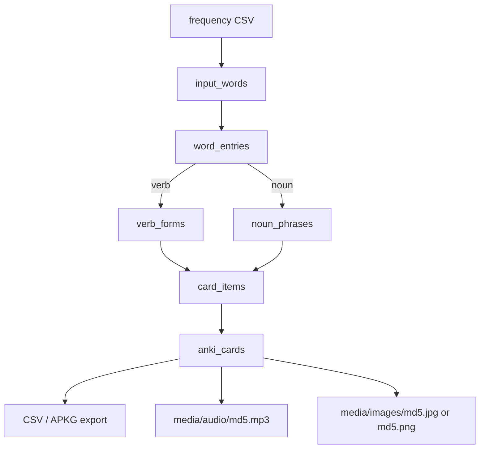
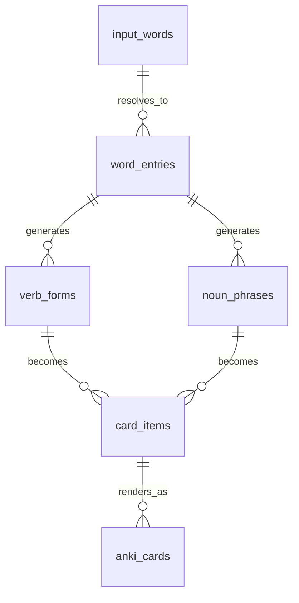

# Italian Flashcards Implementation Plan

Build a small SQLite-backed generator that turns Italian frequency-list words into Anki cards. Keep the system simple: import words, classify them, generate verb/noun study rows, attach media by MD5 filename, and export cards.

This design follows `../italiananki`: media files are named from the MD5 hash of the exact text used as the media key.

## MVP

1. Import frequency-ranked Italian words.
2. Classify each word into the approved Italian word-type groups.
3. Store the resolved base entry:
   - verbs use the infinitive, e.g. `andare`
   - nouns use the singular form, e.g. `casa`
4. Generate study items:
   - verb conjugation forms
   - noun article/preposition phrases
5. Generate Anki-style cards from study items.
6. Resolve audio and images by MD5 hash of the displayed Italian/media text.
7. Export CSV first; `.apkg` can come later.

No import-batch tracking, processing status, validation status, or validation issue workflow is required. The import script should be idempotent: insert new words, skip existing words, and never overwrite generated data unless explicitly told to do so.

## Word Analysis Groups

The word analysis AI must classify every input word into one of these groups. Store the English `word_type` value in the database and use the Italian name in prompts so the model understands the grammar category.

| Italian name | English `word_type` | What it does | Examples |
| --- | --- | --- | --- |
| `nome / sostantivo` | `noun` | Names a person, place, thing, animal, or idea | `cane`, `casa`, `Marco`, `amore` |
| `verbo` | `verb` | Shows an action, state, or event | `mangiare`, `essere`, `andare`, `fare` |
| `articolo` | `article` | Goes before a noun: the, a/an, some | `il`, `la`, `un`, `una`, `del` |
| `aggettivo` | `adjective` | Describes a noun | `bello`, `grande`, `italiano`, `rosso` |
| `pronome` | `pronoun` | Replaces or points to a noun | `io`, `tu`, `lo`, `gli`, `questo`, `quello` |
| `preposizione` | `preposition` | Shows relationships like to, from, in, on, with | `di`, `a`, `da`, `in`, `con`, `su`, `per`, `tra`, `fra` |
| `preposizione articolata` | `articulated_preposition` | A preposition joined with an article | `nel`, `al`, `del`, `sul`, `dalla`, `agli` |
| `congiunzione` | `conjunction` | Joins words, phrases, or clauses | `e`, `ma`, `o`, `perche`, `che`, `se` |
| `avverbio` | `adverb` | Describes a verb, adjective, or whole sentence | `bene`, `male`, `sempre`, `qui`, `molto` |
| `interiezione` | `interjection` | A reaction, exclamation, sound, or filler | `boh`, `mah`, `uffa`, `ahia`, `dai` |
| `dimostrativo` | `demonstrative` | Points to this/these or that/those | `questo`, `questa`, `quello`, `quella` |
| `possessivo` | `possessive` | Shows ownership | `mio`, `tuo`, `suo`, `nostro`, `vostro`, `loro` |
| `numerale` | `numeral` | Shows number or order | `uno`, `due`, `tre`, `primo`, `secondo` |
| `esclamazione / formula sociale` | `social_expression` | Greetings, politeness, and set phrases | `ciao`, `salve`, `grazie`, `prego`, `scusi` |
| `altro` | `other` | Anything that does not fit the approved groups | abbreviations, symbols, malformed rows, unclear fragments |

Analysis rules:

- Choose exactly one primary `word_type` for normal rows.
- If a word has multiple real uses, insert multiple `word_entries` rows and set the most useful one first.
- Use `other` whenever the word is not recognized, cannot be interpreted, or is genuinely outside the approved categories.
- The MVP only generates cards for `verb` and `noun`; the other groups are stored for later workflows.

## Frequency Dictionary Input

The only input source is `freqdic/subtlex-it.csv`. The database input table is based directly on this file and should preserve its useful columns.

Source columns:

| CSV column | Meaning | Store as |
| --- | --- | --- |
| `wordform` | surface word exactly as listed | `input_words.wordform` |
| `freq_count` | raw frequency count | `input_words.freq_count` |
| `zipf` | Zipf frequency value; CSV uses comma decimals | `input_words.zipf` as normalized real |
| `cd_count` | contextual diversity count | `input_words.cd_count` |
| `dom_pos` | dominant part-of-speech code | `input_words.dom_pos` |
| `dom_lemma` | dominant lemma | `input_words.dom_lemma` |
| `dom_lemma_freq` | frequency of dominant lemma | `input_words.dom_lemma_freq` |
| `all_pos` | all possible POS codes | `input_words.all_pos` |
| `all_lemma` | all possible lemmas | `input_words.all_lemma` |
| `all_pos_freq` | frequencies for each POS analysis | `input_words.all_pos_freq` |
| `all_pos_lemma` | POS and lemma pairs | `input_words.all_pos_lemma` |
| `all_pos_lemma_freq` | frequencies for each POS/lemma pair | `input_words.all_pos_lemma_freq` |
| `id` | source row identifier | `input_words.subtlex_id` |

Import rules:

- Use `input_words.id = md5(utf8(wordform))`, based on the exact CSV `wordform` value.
- Use `subtlex_id` from the CSV `id` column as the source row identifier.
- Import and retain only the first 20,000 frequency-ranked input words by default.
- Insert rows that do not exist yet; skip rows already present for the wordform hash.
- Trim existing `input_words` rows beyond the first 20,000 whenever the import script is rerun.
- Duplicate source rows with the same `wordform` collapse to the first imported/frequency-ranked row.
- Normalize `zipf` from comma decimal to normal decimal before storing.
- Keep the raw POS and lemma columns because they are useful hints for the word analysis AI.
- Use `dom_pos` and `dom_lemma` when creating `word_entries`. Do not create entries from secondary/rare `all_pos_lemma` analyses.
- Rows with punctuation, symbols, malformed wordforms, or `<unknown>` lemmas should usually become `word_type = other`.

## SUBTLEX POS Mapping

Use `dom_pos` as the first classification hint and `all_pos` as supporting evidence. These codes are not the final word categories; they are inputs to the word analysis AI.

| SUBTLEX code | Meaning | Default `word_type` |
| --- | --- | --- |
| `NOM` | noun/common nominal form | `noun` |
| `NPR` | proper noun/name | `noun` |
| `VER` | verb | `verb` |
| `DET` | determiner/article | `article` |
| `ADJ` | adjective | `adjective` |
| `PRO` | pronoun/determiner-like pronoun | `pronoun` |
| `PRE` | preposition, including articulated prepositions in this data | `preposition` or `articulated_preposition` |
| `CON` | conjunction | `conjunction` |
| `ADV` | adverb | `adverb` |
| `INT` | interjection/social expression | `interjection` or `social_expression` |
| `NUM` | number | `numeral` |
| `ABR` | abbreviation | `other` |
| `FW` | foreign word | `other` |
| `PON` | punctuation | `other` |
| `SENT` | sentence punctuation | `other` |
| `SYM` | symbol | `other` |

Articulated preposition rule:

- If `dom_pos = PRE` and the wordform is one of `al`, `allo`, `all'`, `alla`, `ai`, `agli`, `alle`, `del`, `dello`, `dell'`, `della`, `dei`, `degli`, `delle`, `dal`, `dallo`, `dall'`, `dalla`, `dai`, `dagli`, `dalle`, `nel`, `nello`, `nell'`, `nella`, `nei`, `negli`, `nelle`, `sul`, `sullo`, `sull'`, `sulla`, `sui`, `sugli`, `sulle`, classify as `articulated_preposition`.
- Otherwise keep plain prepositions as `preposition`.

## Flow



## Media Rule

Audio and images are not stored as arbitrary filenames. They are derived from the text they represent.

```text
md5(utf8(text)) + extension
```

Examples:

| Text key | Media type | Filename rule |
| --- | --- | --- |
| `parliamo` | audio | `md5("parliamo").mp3` |
| `la casa` | audio | `md5("la casa").mp3` |
| `casa` | image | `md5("casa").jpg` or `md5("casa").png` |
| `andare` | image | `md5("andare").jpg` or `md5("andare").png` |

Python helper:

```python
import hashlib


def media_hash(text: str) -> str:
    return hashlib.md5(text.strip().encode("utf-8")).hexdigest()


def audio_filename(text: str) -> str:
    return f"{media_hash(text)}.mp3"


def image_filename(text: str, ext: str = "jpg") -> str:
    return f"{media_hash(text)}.{ext}"
```

### Which Text Gets Hashed

Use the same text that is displayed or represented on the card.

| Card data | Hash key |
| --- | --- |
| audio for a conjugated verb card | the displayed Italian answer, e.g. `parliamo` |
| audio for a noun phrase card | the displayed Italian phrase, e.g. `alla casa` |
| image for a verb conjugation card | the verb infinitive, e.g. `parlare`, so all conjugations share one image |
| image for a noun card | the base noun or displayed phrase, usually `casa` |
| image for a phrase card | the displayed Italian phrase |

This means a generated card does not need to store media filenames. It only needs `audio_text` and `image_text`; filenames are computed when exporting.

## Simple Database Schema

Use SQLite. Enable foreign keys on every connection.

```sql
PRAGMA foreign_keys = ON;
```

### 1. input_words

Raw frequency-list rows.

```sql
CREATE TABLE input_words (
    id TEXT PRIMARY KEY,                      -- md5(utf8(wordform))
    subtlex_id INTEGER NOT NULL UNIQUE,       -- CSV column: id
    wordform TEXT NOT NULL,                  -- CSV column: wordform
    normalized_word TEXT NOT NULL,
    frequency_rank INTEGER,                  -- row order after header
    freq_count INTEGER,                      -- CSV column: freq_count
    zipf REAL,                               -- CSV column: zipf, comma decimal normalized
    cd_count INTEGER,                        -- CSV column: cd_count
    dom_pos TEXT,                            -- CSV column: dom_pos
    dom_lemma TEXT,                          -- CSV column: dom_lemma
    dom_lemma_freq INTEGER,                  -- CSV column: dom_lemma_freq
    all_pos TEXT,                            -- CSV column: all_pos
    all_lemma TEXT,                          -- CSV column: all_lemma
    all_pos_freq TEXT,                       -- CSV column: all_pos_freq
    all_pos_lemma TEXT,                      -- CSV column: all_pos_lemma
    all_pos_lemma_freq TEXT,                 -- CSV column: all_pos_lemma_freq
    created_at TEXT NOT NULL DEFAULT CURRENT_TIMESTAMP
);

CREATE INDEX idx_input_words_rank ON input_words(frequency_rank);
CREATE INDEX idx_input_words_normalized_word ON input_words(normalized_word);
CREATE INDEX idx_input_words_dom_pos ON input_words(dom_pos);
CREATE INDEX idx_input_words_dom_lemma ON input_words(dom_lemma);
```

### 2. word_entries

The resolved dictionary item for an input word. One input can have multiple entries if it is ambiguous, but most words will have one.

```sql
CREATE TABLE word_entries (
    id TEXT PRIMARY KEY,                      -- md5(utf8(lemma))
    input_word_id TEXT NOT NULL,
    word_type TEXT NOT NULL,                 -- approved English word_type from Word Analysis Groups
    lemma TEXT NOT NULL,                     -- parlare, casa, buono
    english TEXT,
    confidence REAL,

    -- Verb fields, used when word_type = 'verb'
    infinitive TEXT,
    auxiliary TEXT,                          -- avere, essere, both, unknown
    past_participle TEXT,
    is_reflexive INTEGER NOT NULL DEFAULT 0,

    -- Noun fields, used when word_type = 'noun'
    singular TEXT,
    singular_english TEXT,
    plural TEXT,
    plural_english TEXT,
    gender TEXT,                             -- masculine, feminine, both, unknown
    definite_singular TEXT,                  -- il, lo, l', la
    definite_plural TEXT,                    -- i, gli, le
    indefinite_singular TEXT,                -- un, uno, una, un'

    created_at TEXT NOT NULL DEFAULT CURRENT_TIMESTAMP,
    FOREIGN KEY (input_word_id) REFERENCES input_words(id) ON DELETE CASCADE
);

CREATE INDEX idx_word_entries_input_word_id ON word_entries(input_word_id);
CREATE INDEX idx_word_entries_type ON word_entries(word_type);
CREATE INDEX idx_word_entries_lemma ON word_entries(lemma);
CREATE UNIQUE INDEX idx_word_entries_type_lemma ON word_entries(word_type, lemma);
```

Each `input_words` row maps to at most one `word_entries` row, based on its dominant `dom_pos` and `dom_lemma`. `word_entries` are still deduplicated by `word_type` and canonical `lemma`; when the same dominant lemma appears in multiple `input_words` rows, link the entry to the first frequency-ranked `input_words.id` that produced it. This avoids paying the AI repeatedly for duplicate lemmas while preserving a relationship back to the frequency source.

Reruns should use existing `word_entries` rows as the processing marker. A complete existing row must not be sent to the AI again. If a row exists but is missing required fields for its `word_type`, recompute that row and update it in place.

### 3. verb_forms

Generated verb forms.

```sql
CREATE TABLE verb_forms (
    id INTEGER PRIMARY KEY AUTOINCREMENT,
    word_entry_id TEXT NOT NULL,
    tense TEXT NOT NULL,                     -- presente, passato_prossimo, imperfetto, imperativo
    person TEXT,                             -- io, tu, lui_lei, noi, voi, loro, Lei
    polarity TEXT NOT NULL DEFAULT 'positive',
    italian TEXT NOT NULL,
    english TEXT NOT NULL,
    labels TEXT,                             -- pipe-separated labels for Anki tags/chips
    FOREIGN KEY (word_entry_id) REFERENCES word_entries(id) ON DELETE CASCADE,
    UNIQUE(word_entry_id, tense, person, polarity, italian)
);

CREATE INDEX idx_verb_forms_entry ON verb_forms(word_entry_id);
CREATE INDEX idx_verb_forms_tense ON verb_forms(tense);
```

### 4. noun_phrases

Generated noun forms, article phrases, and preposition phrases.

```sql
CREATE TABLE noun_phrases (
    id INTEGER PRIMARY KEY AUTOINCREMENT,
    word_entry_id TEXT NOT NULL,
    phrase_type TEXT NOT NULL,               -- bare, definite, indefinite, articulated_preposition, preposition_phrase
    number TEXT NOT NULL,                    -- singular, plural
    preposition TEXT,                        -- a, di, da, in, su, con, per, tra, fra
    italian TEXT NOT NULL,
    english TEXT NOT NULL,
    labels TEXT,
    FOREIGN KEY (word_entry_id) REFERENCES word_entries(id) ON DELETE CASCADE,
    UNIQUE(word_entry_id, phrase_type, number, preposition, italian)
);

CREATE INDEX idx_noun_phrases_entry ON noun_phrases(word_entry_id);
CREATE INDEX idx_noun_phrases_type ON noun_phrases(phrase_type);
```

### 5. card_items

A normalized study item before final Anki rendering. Both verb forms and noun phrases become card items.

```sql
CREATE TABLE card_items (
    id INTEGER PRIMARY KEY AUTOINCREMENT,
    source_type TEXT NOT NULL,               -- verb_form, noun_phrase, manual
    source_id INTEGER,                       -- id from verb_forms or noun_phrases
    deck TEXT NOT NULL,
    front_text TEXT NOT NULL,                -- usually English prompt
    front_labels TEXT,
    back_highlight TEXT NOT NULL,            -- main Italian answer displayed on card
    back_text TEXT,                          -- extra Italian/context text, e.g. infinitive
    audio_text TEXT,                         -- hash this for audio filename
    image_text TEXT                          -- hash this for image filename
);

CREATE INDEX idx_card_items_deck ON card_items(deck);
CREATE INDEX idx_card_items_source ON card_items(source_type, source_id);
```

### 6. anki_cards

Final export rows. Keep this table optional but useful because it freezes exactly what will be exported.

```sql
CREATE TABLE anki_cards (
    id INTEGER PRIMARY KEY AUTOINCREMENT,
    card_item_id INTEGER NOT NULL,
    direction TEXT NOT NULL DEFAULT 'en_to_it',
    deck TEXT NOT NULL,
    front_text TEXT NOT NULL,
    front_labels TEXT,
    back_highlight TEXT NOT NULL,
    back_text TEXT,
    audio_text TEXT,
    image_text TEXT,
    guid TEXT NOT NULL UNIQUE,
    FOREIGN KEY (card_item_id) REFERENCES card_items(id) ON DELETE CASCADE
);

CREATE INDEX idx_anki_cards_deck ON anki_cards(deck);
CREATE INDEX idx_anki_cards_direction ON anki_cards(direction);
```

That is the full MVP database. No separate tables for languages, import batches, media assets, exports, validation issues, statuses, or many-to-many media joins are needed yet.

## Data Connections



Connection rules:

| From | To | Rule |
| --- | --- | --- |
| `input_words` | `word_entries` | one raw word can resolve to one or more dictionary entries |
| `word_entries` | `verb_forms` | only verb entries generate verb forms |
| `word_entries` | `noun_phrases` | only noun entries generate noun phrases |
| `verb_forms` | `card_items` | each generated verb form can become a study item |
| `noun_phrases` | `card_items` | each generated noun phrase can become a study item |
| `card_items` | `anki_cards` | cards freeze final export text and media keys |

## Verb Generation

Generate these forms first:

| Tense | Persons |
| --- | --- |
| `presente` | io, tu, lui_lei, noi, voi, loro |
| `passato_prossimo` | io, tu, lui_lei, noi, voi, loro |
| `imperfetto` | io, tu, lui_lei, noi, voi, loro |
| `imperativo` | tu, Lei, noi, voi |

Rules:

- Store the infinitive on `word_entries.infinitive`.
- Store each concrete conjugation in `verb_forms.italian`.
- For audio, set `card_items.audio_text = verb_forms.italian`.
- For images, set `card_items.image_text = word_entries.infinitive` so all conjugations of a verb share one image.
- Do not generate `io` imperative cards.
- If the analyzer cannot classify a word, store it as `other` and do not generate verb/noun rows for it.

Example:

| front_text | back_highlight | back_text | audio_text | image_text |
| --- | --- | --- | --- | --- |
| we speak / we are speaking | parliamo | parlare | parliamo | parlare |
| I was speaking / I used to speak | parlavo | parlare | parlavo | parlare |
| Speak! | parla | parlare | parla | parlare |

## Noun Generation

Resolve these fields on `word_entries` for nouns:

| Field | Example |
| --- | --- |
| `singular` | casa |
| `singular_english` | house |
| `plural` | case |
| `plural_english` | houses |
| `gender` | feminine |
| `definite_singular` | la |
| `definite_plural` | le |
| `indefinite_singular` | una |
| `english` | house |

### Noun Phrases per Card

Each noun generates exactly **4 cards**:

1. **Definite singular** — "the friend" → "la amico"
2. **Definite plural** — "the friends" → "le amiche"
3. **One variant singular** — deterministically selected from 13 options
4. **One variant plural** — same variant as #3, conjugated for plural

### Variant Options (13 total)

Deterministically select ONE from these 13 options using MD5 hash of singular+plural:

**Articulated Prepositions (5):**
- a (to) → "al amico", "ai amici"
- di (of) → "del amico", "dei amici"
- da (from) → "dal amico", "dai amici"
- in (in) → "nel amico", "nei amici"
- su (on) → "sul amico", "sui amici"

**Demonstratives (2):**
- questo (this) → "questo amico", "questi amici"
- quello (that) → "quel amico", "quei amici"

**Possessives (6):**
- mio (my) → "mio amico", "miei amici"
- tuo (your) → "tuo amico", "tuoi amici"
- suo (his/her) → "suo amico", "suoi amici"
- nostro (our) → "nostro amico", "nostri amici"
- vostro (your pl) → "vostro amico", "vostri amici"
- loro (their) → "loro amico", "loro amici"

Hash calculation:
```
hash = md5(singular + "|" + plural)
value = int(hash[:8], 16) % 13
selected_option = PHRASE_OPTIONS[value]
```

### Articulated Preposition Grid

| Prep | il | lo | l' | la | i | gli | le |
| --- | --- | --- | --- | --- | --- | --- | --- |
| a | al | allo | all' | alla | ai | agli | alle |
| di | del | dello | dell' | della | dei | degli | delle |
| da | dal | dallo | dall' | dalla | dai | dagli | dalle |
| in | nel | nello | nell' | nella | nei | negli | nelle |
| su | sul | sullo | sull' | sulla | sui | sugli | sulle |

### Demonstratives

| Demo | il/lo/l' | la | i/gli | le |
| --- | --- | --- | --- | --- |
| questo | questo | questa | questi | queste |
| quello | quel/quello | quella | quei/quegli | quelle |

### Possessives

| Poss | il/lo/l' | la | i/gli | le |
| --- | --- | --- | --- | --- |
| mio | mio | mia | miei | mie |
| tuo | tuo | tua | tuoi | tue |
| suo | suo | sua | suoi | sue |
| nostro | nostro | nostra | nostri | nostre |
| vostro | vostro | vostra | vostri | vostre |
| loro | loro | loro | loro | loro |

Rules:

- For audio, set `card_items.audio_text = noun_phrases.italian`.
- For images, set `card_items.image_text = word_entries.singular` so all variants share one image.
- Use apostrophe articles with no extra space: `l'amico`, `all'amico`, `dell'amico`.
- Deterministic selection ensures reproducibility: **the same noun always generates the same variant**.

Example (noun: "amico", plural: "amici"):

| Card # | front_text | back_highlight | phrase_type | Audio |
| --- | --- | --- | --- | --- |
| 1 | the friend | la amico | definite | la amico |
| 2 | the friends | gli amici | definite | gli amici |
| 3 | to the friend | al amico | articulated_preposition (a) | al amico |
| 4 | to the friends | ai amici | articulated_preposition (a) | ai amici |

## Card Export

Use the same CSV shape as `../italiananki` where possible:

```csv
front_text,front_labels,back_highlight,back_text,audio,generate_image
```

Map from `anki_cards`:

| CSV column | Database field |
| --- | --- |
| `front_text` | `front_text` |
| `front_labels` | `front_labels` |
| `back_highlight` | `back_highlight` |
| `back_text` | `back_text` |
| `audio` | `audio_text` |
| `generate_image` | true unless no image should be generated |

During `.apkg` creation:

1. Resolve audio filename from `audio_text`: `media/audio_compressed/<md5>.mp3`, fallback `media/audio/<md5>.mp3`.
2. Resolve image filename from `image_text`: `media/images_compressed/<md5>.jpg`, fallback `media/images/<md5>.png`.
3. Add `[sound:<md5>.mp3]` to the card when the file exists.
4. Add `.jpg">` or `.png">` when the file exists.
5. Create a stable Anki GUID from deck + front/back content, not from media paths.

## Implementation Order

1. Run `scripts/1_import_subtlex_it.py` to create the six SQLite tables and import the first 20,000 frequency-ranked rows from `freqdic/subtlex-it.csv` into `input_words`, skipping rows already present by `md5(wordform)` and trimming rows beyond that cap.
2. Run `scripts/2_create_verb_word_entries.py` to create the first verb `word_entries` from dominant `dom_pos`/`dom_lemma` values.
3. Run `scripts/3_create_noun_word_entries.py` to create the first noun `word_entries` from dominant `dom_pos`/`dom_lemma` values.
4. Run `scripts/4_create_verb_forms.py` to generate `verb_forms` for the MVP tenses.
5. Run `scripts/5_create_noun_phrases.py` to generate `noun_phrases` from article/preposition rules.
6. Add later scripts to classify remaining word types and insert additional `word_entries`.
7. Convert generated rows into `card_items` with `audio_text` and `image_text` set correctly.
8. Render `anki_cards` from `card_items`.
9. Export CSV using the `../italiananki` columns.
10. Generate media files using MD5 filenames from `audio_text` and `image_text`.
11. Build `.apkg` once CSV + media are working.

### Current scripts

Run scripts from the repository root with the virtual environment activated:

```sh
source .venv/bin/activate
python scripts/1_import_subtlex_it.py
python scripts/2_create_verb_word_entries.py
python scripts/3_create_noun_word_entries.py
python scripts/4_create_verb_forms.py
python scripts/5_create_noun_phrases.py
```

`scripts/1_import_subtlex_it.py` creates `database.sqlite`, imports unique `input_words` rows, and keeps only the first 20,000 by default. `scripts/2_create_verb_word_entries.py` uses OpenRouter structured output, reads the `.openrouter` key file, processes only the first 100 unique verb lemmas by default, and skips lemmas already present in `word_entries`. `scripts/3_create_noun_word_entries.py` does the same for the first 100 unique noun/proper-noun lemmas. `scripts/4_create_verb_forms.py` generates the configured verb tenses for verb entries without existing forms. `scripts/5_create_noun_phrases.py` generates noun phrases for noun entries without existing phrases. Use `--dry-run` to preview candidates without calling the AI.

## Done Criteria

The MVP is done when it can:

- import a top-frequency Italian word list;
- generate simple verb and noun cards;
- store only the bare minimum needed to regenerate/export cards;
- name audio and image files using MD5 hashes of the displayed/media text;
- export CSV compatible with the existing `italiananki` style;
- put unrecognized words in `other` instead of using processing or validation statuses.
