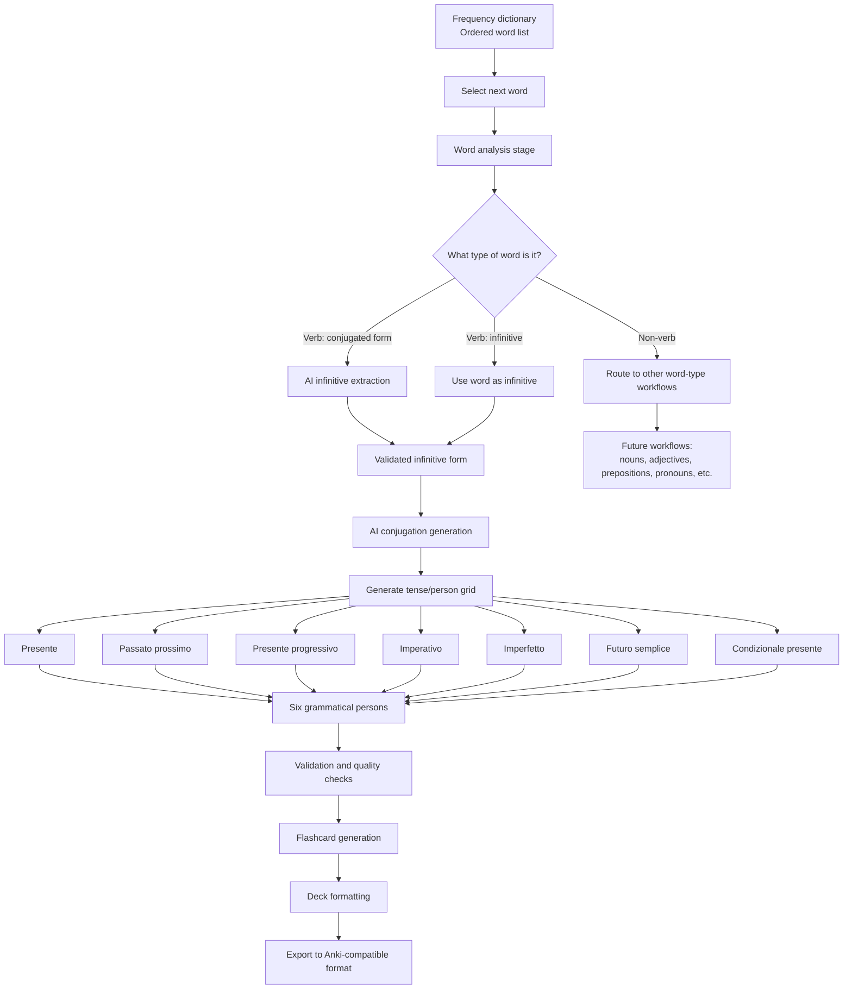

# italian-flashcards

## 1. Project overview

The project is a data-processing and AI-assisted content generation system for creating language-learning flashcard decks.

The first implementation focuses on Italian, but the system should be designed so that the same architecture can later support other languages.

The system starts with a frequency dictionary: a list of words ordered from most frequently used to least frequently used. Each word is processed individually. Depending on the type of word, the system determines what kind of language-learning content should be generated.

For Italian verbs, the system identifies the infinitive form, generates conjugations across key tenses and grammatical persons, and then converts those outputs into flashcard-ready data.

---

## 2. High-level goal

Create a repeatable pipeline that can:

1. Take a frequency-ordered word list.
2. Process each word individually.
3. Identify the word type, such as verb, noun, adjective, adverb, preposition, etc.
4. Apply the appropriate generation workflow for that word type.
5. For verbs, identify the infinitive form.
6. Generate useful conjugation data.
7. Convert the generated language data into structured flashcard decks.
8. Export the final decks for use in Anki or another spaced-repetition system.

---

## 3. Functional diagram



---

## 4. Verb-processing workflow

### 4.1 Input

The input is a single Italian word from the frequency dictionary.

Examples:

* essere
* sono
* avere
* ha
* andare
* vado
* fatto
* mangiare
* mangiato

---

### 4.2 Word classification

The system determines whether the word is a verb.

Possible outcomes:

| Input type      | Example | Action                                                               |
| --------------- | ------: | -------------------------------------------------------------------- |
| Infinitive verb |  andare | Use directly as the infinitive                                       |
| Conjugated verb |    vado | Identify the infinitive: andare                                      |
| Past participle |   fatto | Identify likely infinitive: fare                                     |
| Ambiguous form  |    sono | Resolve likely infinitive: essere, based on context or lexical rules |
| Non-verb        |    casa | Send to non-verb workflow                                            |

---

## 5. Infinitive extraction

If the word is a verb but not an infinitive, the system runs an AI process to identify the infinitive.

### Example

Input word:

> vado

AI output:

> andare

Another example:

Input word:

> ho

AI output:

> avere

Another example:

Input word:

> era

AI output:

> essere

---

## 6. Conjugation generation

Once the infinitive has been identified, the system generates conjugations across selected tenses and grammatical persons.

### Target tenses

The first version should generate the following Italian verb forms:

1. Presente
2. Passato prossimo
3. Presente progressivo
4. Imperativo
5. Imperfetto
6. Futuro semplice
7. Condizionale presente

---

## 7. Grammatical persons

For each tense, the system generates forms for the six standard grammatical persons.

| Person                 | Italian pronoun | English equivalent |
| ---------------------- | --------------- | ------------------ |
| First person singular  | io              | I                  |
| Second person singular | tu              | you                |
| Third person singular  | lui / lei       | he / she / it      |
| First person plural    | noi             | we                 |
| Second person plural   | voi             | you plural         |
| Third person plural    | loro            | they               |

---

## 8. Example output for one verb

For the infinitive:

> parlare

The system would generate a structured output similar to this.

| Tense                 | io           | tu            | lui/lei      | noi             | voi            | loro            |
| --------------------- | ------------ | ------------- | ------------ | --------------- | -------------- | --------------- |
| Presente              | parlo        | parli         | parla        | parliamo        | parlate        | parlano         |
| Passato prossimo      | ho parlato   | hai parlato   | ha parlato   | abbiamo parlato | avete parlato  | hanno parlato   |
| Presente progressivo  | sto parlando | stai parlando | sta parlando | stiamo parlando | state parlando | stanno parlando |
| Imperfetto            | parlavo      | parlavi       | parlava      | parlavamo       | parlavate      | parlavano       |
| Futuro semplice       | parlerò      | parlerai      | parlerà      | parleremo       | parlerete      | parleranno      |
| Condizionale presente | parlerei     | parleresti    | parlerebbe   | parleremmo      | parlereste     | parlerebbero    |

The imperativo is slightly different because it does not naturally use all six persons in the same way as indicative tenses. A practical version could include:

| Person | Imperativo |
| ------ | ---------- |
| tu     | parla      |
| Lei    | parli      |
| noi    | parliamo   |
| voi    | parlate    |
| loro   | parlino    |

For the first version of the system, the imperative may need a special handling rule rather than being treated as a standard six-person tense.

---

## 9. Flashcard generation logic

Once the conjugation table is generated, the system converts each item into one or more flashcards.

### Possible card types

#### Recognition card

Front:

> parlavo

Back:

> I was speaking / I used to speak
> Infinitive: parlare
> Tense: imperfetto
> Person: io

#### Production card

Front:

> How do you say “I was speaking” in Italian?

Back:

> parlavo

#### Infinitive recognition card

Front:

> vado

Back:

> Infinitive: andare
> Meaning: I go / I am going

#### Conjugation prompt card

Front:

> Conjugate parlare in the presente for io.

Back:

> parlo

---

## 10. Recommended data structure

A structured JSON-style output for each verb could look like this:

```json
{
  "source_word": "vado",
  "word_type": "verb",
  "infinitive": "andare",
  "language": "Italian",
  "conjugations": {
    "presente": {
      "io": "vado",
      "tu": "vai",
      "lui_lei": "va",
      "noi": "andiamo",
      "voi": "andate",
      "loro": "vanno"
    },
    "passato_prossimo": {
      "io": "sono andato/andata",
      "tu": "sei andato/andata",
      "lui_lei": "è andato/andata",
      "noi": "siamo andati/andate",
      "voi": "siete andati/andate",
      "loro": "sono andati/andate"
    }
  }
}
```

This structure keeps the system flexible and allows the same source data to be converted into different flashcard formats later.

---

## 11. Quality control requirements

Because AI-generated conjugations can contain errors, the pipeline should include a validation stage.

Recommended validation checks:

1. Confirm the infinitive exists in a dictionary or lexical database.
2. Confirm the tense labels are valid for the target language.
3. Confirm the generated conjugations match a trusted conjugation source where possible.
4. Flag irregular verbs for extra review.
5. Flag ambiguous source words.
6. Flag forms where gender or number affects the answer, such as passato prossimo with essere.
7. Flag defective or unusual verbs.
8. Detect duplicate cards before export.

---

## 12. Special Italian issues to handle

Italian verb generation needs some language-specific rules.

### 12.1 Auxiliary verbs in passato prossimo

Some verbs use avere:

> ho parlato

Some verbs use essere:

> sono andato / sono andata

The system needs to store which auxiliary is used.

### 12.2 Gender and number agreement

With essere verbs, the past participle changes by gender and number:

| Subject             | Example      |
| ------------------- | ------------ |
| io masculine        | sono andato  |
| io feminine         | sono andata  |
| noi masculine/mixed | siamo andati |
| noi feminine        | siamo andate |

The flashcard system needs to decide whether to:

1. Show both masculine and feminine forms.
2. Default to masculine/mixed forms.
3. Generate separate cards for masculine and feminine answers.

### 12.3 Imperative forms

Imperativo does not map neatly onto all six standard persons. It needs special handling.

Possible practical approach:

* tu
* Lei, formal
* noi
* voi
* loro, formal/plural

The system may omit io because a first-person singular imperative is not normally used.

### 12.4 Ambiguous word forms

Some Italian forms can map to multiple possible infinitives or grammatical functions.

Example:

> sono

Possible interpretations:

* essere, io sono
* essere, loro sono

The system should either:

1. Store all valid interpretations.
2. Choose the most likely interpretation based on frequency.
3. Create multiple cards.
4. Flag the item for manual review.

---

## 13. Proposed pipeline stages

### Stage 1: Input preparation

* Import frequency dictionary.
* Clean data.
* Remove duplicates.
* Normalise casing.
* Store rank and frequency metadata.

### Stage 2: Word analysis

* Identify word type.
* Detect whether word is a verb.
* Detect whether verb is infinitive or conjugated.

### Stage 3: Infinitive resolution

* For infinitive verbs, pass through unchanged.
* For conjugated verbs, identify infinitive.
* Store confidence score.
* Flag ambiguity.

### Stage 4: Verb generation

* Generate conjugations for target tenses.
* Generate six-person conjugation tables where applicable.
* Apply Italian-specific rules for auxiliary verbs, agreement, and imperatives.

### Stage 5: Validation

* Check against trusted grammar/conjugation sources.
* Validate tense/person completeness.
* Flag irregular or ambiguous outputs.

### Stage 6: Flashcard transformation

* Convert conjugation data into flashcard rows.
* Generate front text.
* Generate back text.
* Add metadata fields.
* Add tags.

### Stage 7: Export

* Export to CSV, TSV, JSON, or Anki package format.
* Preserve metadata so cards can be filtered by frequency, tense, verb type, difficulty, or irregularity.

---

## 14. Suggested deck structure

The system could generate several different decks or subdecks.

### Option A: By frequency band

* Italian verbs 1–500
* Italian verbs 501–1000
* Italian verbs 1001–2000

### Option B: By tense

* Italian verbs: presente
* Italian verbs: passato prossimo
* Italian verbs: imperfetto
* Italian verbs: futuro semplice
* Italian verbs: condizionale presente

### Option C: By learning task

* Recognise conjugated forms
* Produce conjugated forms
* Identify infinitives
* Translate example sentences

### Option D: Combined structure

Example:

* Italian::Verbs::Top 500::Presente
* Italian::Verbs::Top 500::Passato prossimo
* Italian::Verbs::Top 500::Imperfetto
* Italian::Verbs::Top 500::Infinitive recognition

---

## 15. Minimum viable version

The simplest useful version of the project could be:

1. Input: top 500 Italian words.
2. Detect verbs only.
3. Identify infinitives.
4. Generate conjugations for:

   * presente
   * passato prossimo
   * imperfetto
5. Generate recognition and production cards.
6. Export to Anki-compatible CSV.
7. Manually review flagged irregular or ambiguous verbs.

---

## 16. Future expansion

After verbs are working, the same architecture can be expanded to other word types.

### Nouns

Possible generated cards:

* Singular/plural
* Definite article
* Indefinite article
* Gender
* English meaning
* Example sentence

### Adjectives

Possible generated cards:

* Masculine singular
* Feminine singular
* Masculine plural
* Feminine plural
* English meaning
* Example sentence

### Prepositions

Possible generated cards:

* Meaning
* Example phrase
* Contracted forms, such as di + il = del

### Pronouns

Possible generated cards:

* Subject pronouns
* Direct object pronouns
* Indirect object pronouns
* Reflexive pronouns
* Combined pronouns

---

## 17. Summary

This project creates a generalisable language-learning pipeline that starts with frequency-ranked words and produces structured flashcard decks.

For Italian verbs, the core workflow is:

1. Take a word from the frequency dictionary.
2. Determine whether it is a verb.
3. If it is a conjugated verb, identify the infinitive.
4. Generate conjugations across key tenses.
5. Generate forms for the relevant grammatical persons.
6. Validate the output.
7. Transform the output into flashcards.
8. Export the flashcards for spaced-repetition learning.

The first version should focus on verbs because they provide a clear, high-value workflow. Once the verb workflow is stable, the same system can be extended to nouns, adjectives, prepositions, pronouns, and other word classes.
