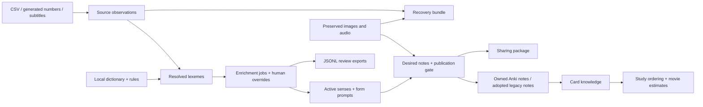

# Data and application review — 9 October 2026

This is a **new review of the later, schema-v5 working tree and actual data**. It supplements [the earlier architectural review](RECOMMENDATIONS_REVIEW_2026-10-09.md) and the historical [v4 proposal](RECOMMENDATIONS.md). Earlier implementation checkmarks are not evidence that every associated data problem has been resolved.

The best next investment is **meaning-preserving transformations and verifiable publication**. Keep the local Python CLI, SQLite, and Anki architecture. The repository does not need a server, distributed queue, or replacement database to solve the problems found here. It needs stronger contracts between source observations, selected meanings, generated grammar exercises, media, and study history.

The current data passes SQLite integrity and foreign-key checks. That is useful, but it does not establish linguistic correctness. The review found ready cards with mechanically generated, unsuitable English; ambiguous production prompts; dictionary parsing that mixes grammatical attributes from different forms; incomplete sense provenance; and gaps between stored state and exported state.

Several concrete defects were fixed during this pass. The remaining recommendations below are explicitly marked **open**; they have not been disguised as completed work. In particular, no bulk linguistic approval, semantic identity migration, dictionary download, provider generation, or live Anki mutation was performed during this follow-up.

## Evidence and boundaries

- Created a consistent copy of the current SQLite database using the SQLite backup API. Snapshot SHA-256: `a2a40e29aa20b92d67d6964fcf2004eb7f7e34240b355b3b52c37d1a0c6d091a`.
- The snapshot contains 15 running enrichment jobs and six completed sync records. These record activity already underway; they are not calls made by this review. Live JSONL exports changed during inspection, so their differences from the snapshot are treated as a checkpoint-coordination issue, not proof of lost data.
- Parsed all 17 input CSVs: **24,434 data rows**, including the 15,000-row SUBTLEX file. No row-width errors were found. There are two exact duplicate rows in the iTalki CSV. Parsed both generated JSONL files.
- Read every active list through the actual readers and resolver: **11,552 observations → 11,420 list memberships → 5,010 active lexemes**. Inspected raw-to-root changes, collapsed rows, multiple dictionary entries, generated fields, job results, review issues, identity records, exports, recovery code, and settings.
- Used the installed dictionary index as primary evidence for dictionary transformations. It identifies an import on `2026-10-08 19:38:19`; this particular index predates the newer importer’s content-hash/parser-version metadata.
- Ran a repeatable structural scan of every desired note, then inspected deterministic samples across available card types. All 810 phrase notes were awaiting enrichment; there were no completed phrase outputs to certify.
- Checked all **2,275 distinct media filenames referenced by ready notes**. Every reference resolved; images passed Pillow verification. Visually inspected the current tongue and biscuit illustrations. Probed four distinct referenced MP3s: each reported MP3, mono, 44.1 kHz and a positive duration. This does **not** certify every recording’s pronunciation or every image’s meaning.
- Rebuilt an isolated copy twice using the updated source resolver, queue planner, note builder, and JSONL exporter. No providers or Anki were contacted. The second pass reopened zero jobs and produced identical lexeme-export bytes.
- Compared every file in the earlier media inventory: **73,956 present, zero missing, zero changed in size or modification time**. This is a preservation check, not a comparison against historical byte hashes, which the old inventory did not contain.

The durable, text-only measurements are in [DATA_REVIEW_EVIDENCE_2026-10-09.json](DATA_REVIEW_EVIDENCE_2026-10-09.json). They contain counts and record keys, not subtitle excerpts. The full database snapshot and exploratory output remain outside the repository under `/tmp/italian_data_review_20261009/`; those temporary files are not a backup strategy.

Reproduce a current, offline census with:

```sh
./run.sh data-review --out audit_reports/data-review.json
./run.sh data-review --database /path/to/snapshot.sqlite --out audit_reports/snapshot-review.json
```

This command copies the selected database into an in-memory snapshot, performs no migration, and calls no providers or Anki APIs. Media checks read the current workspace’s files. Warnings are review candidates; exit 1 indicates structural errors. A clean structural scan is not a translation certificate.

## What flows into and out of the app



| Boundary | Contract that matters | Finding |
|---|---|---|
| Input → observation | Preserve original value, source, row and interpretation | Raw observations exist, but row IDs are reader ordinals and semantic variants still collapse. |
| Observation → lexeme | Resolve lemma/POS without silently changing intended meaning | First-entry and dominant-POS heuristics remain major sources of mistakes. |
| Dictionary → grammar | Keep singular gender, plural gender and derivations separate | Current scalar extraction conflates them. |
| Lexeme → generated sense | Record which source meaning was selected | None of the 1,006 active senses has `source_id` or stored sense context. |
| Sense → drill | Produce only forms appropriate to that meaning | Personal forms of “to happen” illustrate failure of this contract. |
| Generated data → ready note | Gate the exact current content and its dependencies | Freshness and pending-verification checks were strengthened in this pass. |
| Ready note → Anki | Preserve identity, ownership, history and successful replacement | Existing guards are valuable; semantic identity and operation-level recovery still need work. |
| Anki → knowledge | Define exactly what a review proves | Recognition accounting was fixed; maturity remains a proxy for comprehension. |
| Data → export | Declare scope, provenance, privacy and generation | APKG sharing has opt-in source restrictions; git exports have a different, broader scope. |
| Data/media → recovery | Restore the same usable workspace without regeneration | Bundles preserve included media, but the dictionary, runtime and Anki collection need separate handling. |

## Measured inventory

The following counts describe the fixed input snapshot, before this pass’s isolated rebuild.

| Item | Count / result |
|---|---:|
| Schema | 5 |
| SQLite integrity / FK violations | `ok` / 0 |
| Active lists | 18 |
| All lexemes / active lexemes | 5,213 / 5,010 |
| Retained lexemes without current membership | 203 |
| Active roots: ready / disputed / new | 836 / 124 / 4,050 |
| All roots: ready / disputed / new | 837 / 132 / 4,244 |
| Active senses / roots with multiple senses | 1,006 / 37 |
| Active senses with `source_id` / context | 0 / 0 |
| Desired notes / ready notes | 10,911 / 3,101 |
| Potential directions on ready notes | 725 recognition + 3,062 production |
| Ready notes with no matching independent note audit | 3,101 |
| Ready notes without audio | 1,386 |
| Ready-note media references missing or invalid | 0 of 2,275 distinct files |
| Textually ambiguous production cue groups | 88 |
| AI jobs | 5,795 |
| Failed jobs | 30, all `verb_prompts` |
| Anki v4 identities / adopted legacy directions | 2,853 / 602 |
| Card-knowledge records | 37,997 |
| Explicit overrides / review decisions | 0 / 0 |
| Asset manifest records | 0 |
| Legacy entries / legacy cards retained | 8,884 / 69,424 |

The 3,787 potential directions are **desired template flags**, not an assertion that Anki contains exactly that many new cards. Adoption and existing study history affect which physical cards supply those directions. Likewise, retained legacy rows are migration evidence; their existence is not a recommendation to delete them.

The 65 ready vocabulary notes whose parent status was `new` were deterministic numbers/letters. They are not evidence of 65 unverified AI outputs. The new publication check explicitly preserves this deterministic exception.

### Source completeness and normalization

| List | Reader observations | Unique membership roots | Collapsed observations | Rows with `/` |
|---|---:|---:|---:|---:|
| eight-mountains | 940 | 936 | 4 | 0 |
| cils-a1 | 485 | 482 | 3 | 52 |
| cils-a2 | 1,037 | 1,033 | 4 | 129 |
| cils-b1 | 1,538 | 1,533 | 5 | 230 |
| cils-b2 | 2,078 | 2,073 | 5 | 306 |
| exam-prep | 567 | 564 | 3 | 5 |
| italki | 563 | 547 | 16 | 0 |
| italki-verbs | 95 | 95 | 0 | 0 |
| interjections | 292 | 287 | 5 | 0 |
| pronouns | 117 | 77 | 40 | 0 |
| conjunctions | 194 | 194 | 0 | 0 |
| alphabet | 26 | 26 | 0 | 2 |
| numbers | 178 | 178 | 0 | 0 |
| avere | 101 | 101 | 0 | 0 |
| fluent-forever | 629 | 617 | 12 | 0 |
| cafe | 184 | 181 | 3 | 0 |
| tutto-bene | 1,128 | 1,098 | 30 | 195 |
| frequency | 1,400 | 1,398 | 2 | 0 |
| **Total** | **11,552** | **11,420** | **132** | **919** |

These are not 132 accidental duplicate words. Some are intended variants: `Brava!`, `Brave!`, `Bravi!`, `Bravo!`; or the gender/number forms of `stesso`, `troppo`, and `molto`. Ninety collapsed list/root groups contain more than one distinct source gloss. Previously `_list_glosses()` read only `list_items.hint`, dropping the other glosses from enrichment even though `source_observations` retained them. That defect is fixed. Preserving the observations does not yet create appropriate cards for every grammatical variant.

Blank source glosses are expected for the 940 subtitle items and 1,400 frequency items; these sources derive their meaning later. A missing dictionary entry is also not automatically bad input: long cafe phrases and generated numbers often have no standalone entry. Report these categories separately instead of using one global “missing dictionary” failure percentage.

`inputs/italian_numbers.csv` has 400 rows, while the active numbers list generates a deterministic set of 178 numbers. The CSV is not the current numbers-list authority. Its presence should be documented to prevent edits that appear to be ignored; it should not be removed as part of a media or data cleanup.

## Changes applied in this pass

These are code changes verified locally. The active worker was not interrupted, and the production database was not rewritten by this follow-up. A running Python process keeps its imported code; the changes take effect on its next normal start.

| Fix | Result and validation |
|---|---|
| Use complete source evidence | Enrichment reads distinct glosses and examples from `source_observations`, retaining membership fallback for older data. Tests cover two meanings collapsed into one membership. |
| Correct recognition knowledge | Secondary senses no longer require nonexistent recognition cards. Deterministic number/letter notes can contribute recognition knowledge. Known roots rise from **270 to 284** on the same snapshot. Suspended cards remain excluded. |
| Preserve movie token mass | Merged memberships sum counts and retain observed forms/earliest occurrence. The stored total rises from **6,021 to 6,039**, matching analysis. |
| Resolve every movie source spelling | Coverage and datasets map all original observations, including `cui` and inflected forms collapsed to other roots. Unmapped resolved tokens fall from **18 to 0**. |
| Gate pending replacements | Non-deterministic roots awaiting verification and forms awaiting refreshed verb prompts cannot newly publish stale generated content. Previously complete records and existing Anki notes are retained. |
| Enforce build freshness | Sync planning, sharing, and audio selection reject invalidated note generations. Changed/revived jobs, refreshes, and imported human edits invalidate the build marker. |
| Roll back failed note builds | Replacing `v4_notes` uses the transaction helper; an injected insert failure leaves the preceding view intact and closes the transaction. |
| Validate audit identity | Duplicate, missing, or foreign response IDs reject the entire audit batch instead of partially certifying it. |
| Reuse preserved images consistently | Rendering and readiness use the same image lookup. An existing baseline JPEG remains usable after compression settings change. No regeneration is required. |
| Report corrupt compressed images | Nonempty but invalid existing JPEGs produce an error and are preserved, rather than being silently treated as completed compression. |
| Improve operational outcomes | Invalid run configuration stops before backup/work. Rejected Anki additions are exposed on the plan and produce a partial exit status. Doctor reports database-health failures; negative review/audit limits are rejected. |
| Prevent recursive recovery copies | A recovery destination inside input, lexicon, or media trees is rejected before it can copy itself. A fixture restore reproduces identical media and detects later bundle corruption. |
| Add repeatable review | `data-review` provides a read-only snapshot census, current publication checks, audit coverage, media references and prompt-collision candidates. |
| Clarify generated-file editing | Documentation now warns that a running worker can overwrite unimported JSONL edits and distinguishes review exports from recovery bundles. Tests explicitly close fixture connections. |

On the isolated rebuild, ready counts become **766 vocab + 1,640 forms + 530 noun phrases = 2,936 notes**. Textual collision groups drop from 88 to 46, largely because the set of publishable notes changed. This is **not** a claim that all those ambiguities were repaired. Thirty-one enrichment jobs reopen to reconsider changed source evidence; no provider calls were made to execute them. Both rebuilds yield lexeme-export SHA-256 `67be911d96242d2a4c185f8f7a85a0cdbd46052e9e33ef6977bf3c55ed4e9675`.

## New recommendations

Priority meanings: **P1** protects meaning, user edits or study history; **P2** improves planning, recoverability and routine operation; **P3** improves maintainability and presentation. “Open” means additional implementation or adjudication is still needed. None of these recommendations requires deleting media.

### D01 — Model grammatical features by form and sense, not one scalar per word

**P1 · Open.** `kaikki.gender()` scans the entire expanded head for masculine/feminine markers. A feminine head can include a masculine diminutive; a masculine singular can include a feminine plural. The current index’s `camera` head includes masculine derivatives, while `braccio` includes both `braccia` and `bracci`. Folding every marker into `gender='both'` loses the relationship among those forms. The existing review queue has already caught examples, so this is supported by both code and stored data.

Store singular gender, alternative plurals with their own genders, countability, and sense applicability as structured features. Give the primary head’s gender precedence over derivational text. Preserve all alternatives from the dictionary instead of choosing the first plural. Make noun details and drills use the selected **form’s** features. Do not simply replace `both` with the first gender and then render every plural using that gender; that would introduce another error.

Acceptance: fixtures cover a gender-changing plural, a same-form dual-gender profession, an invariant noun, a mass noun, and a head with opposite-gender diminutives. Rebuild affected notes for review before publication. Keep existing fields and assets available during migration.

### D02 — Make conjugation exercises depend on the selected meaning’s usage

**P1 · Open.** The snapshot contains ready `succedere` cards such as `succedo → I happen / I am happening` and `succediamo → we happen / we are happening`. The stored dictionary distinguishes “to happen” from succession-related senses. A full morphological table combined with one English infinitive is not enough to produce valid exercises for every person.

Represent usage constraints per sense: impersonal use, allowed persons, transitivity, auxiliary choice, complements and register. Keep “form exists” separate from “this form is appropriate for this selected sense.” `VERB_PROMPTS` should return a prompt or an explicit exclusion with a reason for each requested pair. The current worker accepts omissions and silently ignores unexpected/duplicate pairs; that avoids some batch failures but cannot distinguish a legitimate exclusion from incomplete output.

Acceptance: each requested form is accounted for exactly once as accepted or deliberately excluded; a partial provider response cannot silently become a complete job. Test modal imperatives, reflexives, dual auxiliaries and impersonal meanings. Inspect the 30 failed form jobs before retrying; several error strings describe older validation/decoding failures and do not prove the latest code still fails the same way.

### D03 — Select a dictionary entry using source evidence, and retain the alternatives

**P1 · Open.** `_pick_entry()` and `_kaikki_entry()` choose the first matching entry. The local index has multiple noun entries for `zecca`, including a mint and a tick; `moto` has motorcycle and movement entries. Source evidence can distinguish them, but the first-entry lookup can exclude the relevant evidence before enrichment sees it. Inflection resolution also changes source spellings such as `studentessa` into another root; that may be a useful normalization only if the original form and its gender remain available.

Assign stable IDs to dictionary entries and sense records. Pass the plausible candidates, head features, sense tags and source glosses to the selection step. Persist the selected entry/sense and a reason. Distinguish homographs, spelling variants, inflections and derivations; do not silently treat all four as equivalent root aliases.

Acceptance: a source gloss selecting “tick” cannot be enriched using only the mint entry; a feminine source form remains recoverable in the resulting study content. Measure ambiguous-entry resolution accuracy on a curated set before expanding automation.

### D04 — Give senses identities that survive rewording without changing meaning

**P1 · Open.** All 1,006 active senses have empty `source_id` and `context`. `save_senses()` preserves exact prompt matches, then assigns unmatched prompts to unmatched active indexes in order. This keeps a harmless rewording on its existing note, but it can also reuse a studied identity for an unrelated meaning. The existing “house → home” test covers only the harmless case.

Carry stable `sense_id` values into and out of enrichment. A wording revision should explicitly name the existing sense; a new meaning should receive a new ID. Require review for a semantic replacement of a studied sense. Archive the old meaning and link replacements; never infer semantic equivalence solely from position, equal sense counts, or a changed English string.

Acceptance: reordering and paraphrasing preserve identity, splitting creates additional identities, merging records explicit relationships, and replacing one meaning with another cannot inherit study history without a reviewed mapping.

### D05 — Finish source-variant modeling after preserving the glosses

**P1 · Partly fixed.** The enrichment evidence loss is fixed. The 919 slash-containing rows and the pronoun/interjection collapses still require an explicit model of what was combined. A slash may mean a synonym, gender pair, spelling alternative, abbreviation or different expression. `_first_variant()` cannot distinguish these.

Add a variant relation with raw surface, grammatical features, normalized form and relationship type. Preserve physical CSV line numbers and source hashes. Use explicit list metadata or reviewed mappings for ambiguous slash syntax. Decide which variants should share recognition but have separate production prompts; avoid automatically multiplying every variant into two cards.

Acceptance: every selected source variant is either taught, recognized as an accepted alternative, or explicitly excluded with a reason. A source-to-output coverage report should explain the 117 pronoun observations becoming 77 roots.

### D06 — Fix contextual subtitle interpretation before treating coverage as comprehension

**P1 · Partly fixed.** Token accounting and root mapping are now consistent. The subtitle snapshot contains **1,277 cleaned cues; 6,039 resolved tokens; 31 unresolved tokens; 358 excluded names; 29 ignored numbers**. The study denominator is **6,070**, not every token in the file.

The remaining problem is interpretation. `lemmatise()` classifies `lo`, `la`, `le`, `gli` and `uno` as articles before considering context. These spellings can serve other functions. Dominant SUBTLEX labels are corpus-wide guesses, not contextual annotations. The stored disputed roots include noun/verb and noun/adjective disagreements. Some unresolved tokens are English dialogue or misspellings rather than missing Italian vocabulary. Parentheses are also removed wholesale during subtitle cleanup and may occasionally contain spoken content.

Retain token occurrence, cue location, surface, candidate analyses and the resolution reason/confidence. Add reviewed overrides at the occurrence or pattern level. Separate foreign-language tokens, names, transcription errors and genuinely unresolved Italian. Evaluate a stratified set of frequent ambiguous tokens before adding a heavier tagger or asking an LLM to label the whole film.

With the accounting fixes and the same stored knowledge, coverage is **3,941 / 6,070 = 64.9%**. Reaching 95% would require 410 additional roots under the current model, a minimum of 17 days if all 25 daily slots were recognition cards. This is an optimistic arithmetic estimate, not a guarantee of understanding the film. Production, drills, contextual ambiguity and forgetting are outside that estimate. One hundred percent is unreachable while 31 study tokens remain unresolved.

### D07 — Distinguish publishable, audited and human-approved content

**P1 · Partly fixed.** Stale build and pending dependency checks now block publication. However, the `audits` table is empty: all 3,101 ready snapshot notes lack a matching independent note audit. Enrichment’s `verified=true` checks the supplied word data; it does not independently certify every derived card. The much larger historical audit CSVs describe older cards and must not be presented as current v4 coverage.

Expose separate states for structurally complete, source-verified, independently audited, approved with a reason, and published. Start independent audits with mechanically expanded forms, disputed dictionary patterns and collisions, then use a stable stratified sample across the other types. Keep model-reported confidence separate from observed accuracy.

Acceptance: every published field can be traced to the applicable validation/audit version; changing that content makes its audit stale. A dashboard must show denominators and unaudited counts, not just pass percentages among audited records.

### D08 — Disambiguate the actual production cue across all card types

**P1 · Open; detection added.** Eighty-eight snapshot groups share the same normalized English, hint and labels but expect different Italian answers. Examples include conjugations of `rimanere` and `stare` both prompted as “I stay / I am staying.” Images may distinguish some cards, so these groups are review candidates rather than 88 proven errors. The current disambiguation job considers only active sense index 0 with empty hints/alternatives, and does not cover conjugation or noun-phrase prompts.

Run collision detection after materialization, using the actual visible cue. Apply semantic/context hints or an accepted-answer relation. Where the objective is verb conjugation, it may be appropriate to provide the infinitive explicitly; where it is lexical recall, that would give away the answer, so make the objective explicit. Do not resolve collisions with arbitrary labels such as “word 1.”

Acceptance: every retained collision has a meaningful distinguishing cue or accepts the valid alternatives. Test archived first senses and nonzero active indexes; “first active sense” must not be hard-coded as `idx=0`.

### D09 — Keep editable overrides outside files continuously regenerated by workers

**P1 · Open; immediate workflow documented.** Durable overrides already stored in SQLite survive regeneration. Edits not yet imported from `lexicon/lexemes.jsonl` do not: a running worker exports that file after batches and may replace the user’s edits. `overrides` is empty in the snapshot, so this is a demonstrated workflow risk, not evidence that a specific user edit was lost.

Add a dedicated human-edit input file or `override set/import` command that workers never overwrite. Include expected content version, author, reason and validation. Export the effective lexicon separately from the human input. Reject stale conflicting edits with a useful diff instead of silently choosing a value.

Until then, stop the worker, edit JSONL, run `flashcards lexicon` to import it, then resume. Acceptance: a concurrent export cannot erase an unimported human change; corrections survive source sync, model refresh and recovery.

### D10 — Complete the meaning and ownership contracts for Anki identities

**P1 · Open.** Ownership checks, studied-note retention, replacement read-back and profile binding are significant improvements. The snapshot has 2,853 v4 `note_id` mappings and 602 adopted directions. It also has 390 identity aliases, but the reconciler does not consume `identity_aliases`. All `identity.card_ids` and actual GUID fields are empty. An Anki note ID must not be described as its GUID.

Separate a note’s semantic identity from the Anki object currently carrying it. Store profile, note ID, card IDs/ordinals, content version, adoption relationship and retired aliases. Use explicit reviewed alias transitions for meaning-preserving repairs; do not enable every stored alias automatically. Ensure legacy adoption compares intended meaning, not just a root mapping and review count. Include source attribution when mapping content into legacy fields.

Acceptance: a reviewed spelling repair updates the intended identity without creating duplicate learning history; a different sense cannot take over that history; a timed-out add is rediscovered and entered into the identity ledger; an unrelated note using the same model remains protected.

### D11 — Journal Anki operations and report partial outcomes precisely

**P1 · Partly fixed.** Rejected additions now reach the CLI as a partial outcome. Existing `sync_runs` records store a plan and final status, but not the acknowledged result of every operation. An exception after some updates can leave a partially applied plan that must be reconstructed from Anki on the next run. Updating v4 direction fields before a legacy adoption completes deserves explicit interruption coverage.

Persist planned, acknowledged and verified states for each external operation. Verify replacement content, direction and ownership before retirement, including replacements not written in that specific run. Recover via read-back after uncertain outcomes. Track attempted, acknowledged, verified and rejected counts separately.

Acceptance: an integration fake exercises failure after each operation boundary, timeouts after successful adds, profile changes, duplicate keys, user edits and late study events. Follow that with a disposable Anki-profile test. No such live integration test was performed in this follow-up.

### D12 — Plan actual new cards and protect already-published maintenance work

**P2 · Open.** The optional horizon is currently disabled, which is an intentional configuration choice. When enabled, `selected_roots()` estimates one or two cards per root, while materialization can create many forms and noun drills. The two budgets therefore select different work. Known-root demotion can also change which verbs fall inside the full-form cap, even when existing forms still need maintenance.

Create a shared plan of actual note directions with dependency costs. Budget only new cards; maintain published/adopted content independently of the cap. Reserve a configurable share of new slots for deadline recognition, general vocabulary and drills. Show image/audio requirements before starting work. Preserve the default behavior until the user opts into a horizon; do not silently reinstate the earlier restrictive seven-day default.

Acceptance: enabling a small horizon neither strands required jobs nor repeatedly switches established verb families out of the desired set. The forecast reconciles exactly with selected new directions and explains overdue deadlines.

### D13 — Make facts and illustrations compatible with each selected sense

**P2 · Open.** Facts are keyed by normalized spelling rather than lexeme/sense. The snapshot contains 112 spellings with facts associated with multiple POS records; sharing a fact can be valid, but the schema cannot express when it is not. Images are also reused at root level. The inspected `lingua` image clearly depicts a tongue, while its first ready note combines “language / tongue.” That image does not illustrate both meanings equally.

Add applicability relationships from a preserved fact or asset to lexemes/senses. Keep shared artwork when appropriate, but allow a sense-specific selection. Record attribution/evidence for factual claims and the inputs used to choose an illustration. Model confidence alone should not make an etymological claim publishable.

Acceptance: a fact or image can be reused by several meanings explicitly; a sense change raises a review flag instead of automatically paying to regenerate its media. Preserve every existing asset even if it becomes unreferenced.

### D14 — Inventory and verify existing media before any replacement strategy

**P2 · Partly fixed.** Current media is approximately **4.40 GiB**, including 9,762 PNGs, 10,497 JPEGs and 26,846 MP3s in each audio directory. The manifest table is empty despite these assets. Filename existence, a valid JPEG and a nonempty MP3 are different levels of assurance.

Backfill a read-only inventory with SHA-256, size, media properties, origin where known, compression settings and references. Mark unknown historical provenance as unknown. Verify audio decodability in a resumable scan, then sample pronunciation and image relevance. If an asset fails, report it and generate any authorized replacement under a new identity; keep the original. Do not equate “unreferenced” with “safe to delete.”

Acceptance: every referenced asset has a verified file record; originals and derived files remain linked; a changed voice/style/compression profile cannot silently substitute incompatible cached content. The fallback and corrupt-JPEG preservation fixes in this pass cover two current inconsistencies, not the whole inventory requirement.

### D15 — Export a complete generation with declared privacy and provenance

**P2 · Open.** Individual JSONL/CSV files are atomically replaced, but the set is not published as one checkpoint. During this review the live lexeme JSONL contained newer status counts than the database snapshot. That is expected with an active worker and independently sampled files, but consumers have no generation manifest to establish consistency. The source checkpoint also lacked `dictionary_version`; future source syncs now record it.

Write immutable generation directories and a final manifest containing source hashes, dictionary version, schema/task versions, export hashes and scope. Switch a small current-generation pointer only after all files are complete. Keep actual provider/model metadata separate from mutable aliases such as `opus`. A version string alone is not proof that all dependency versions were reproduced.

Define separate policies for personal git review exports, private recovery bundles and shared APKG files. Sharing currently defaults to excluding every root whose lineage is not wholly opted in; **zero lists currently have `shareable=true`**. Git exports are broader and include 936 movie memberships, although direct example fields are removed. AI-generated notes/facts can paraphrase private context, so deleting only `Example` is not a complete information-flow policy.

Acceptance: an interrupted export leaves the previous complete generation usable; a recipient knows exactly which source scope and artifacts were included; a public export cannot acquire private-derived content merely because its output field has a different name.

### D16 — Finish the recovery contract with dictionary, runtime and Anki history

**P2 · Open; bundle safety tested.** `--include-media` preserves the included media and a fixture restore passed hash verification. The bundle does not include the dictionary index, runtime/dependency lock, or the Anki collection/review history. A restored database may therefore contain desired content but still be unable to run `lexicon sync` offline, since that command requires the dictionary.

Document recovery levels: database-only snapshot, full local pipeline bundle, and complete study-system recovery including an Anki collection backup. Offer a consistent dictionary snapshot or require an explicit external dictionary artifact with a checksum. Record installed dependency versions and tool versions. Verify enough free space before a full copy and publish a completion marker only after verification. Keep recovery bundles private because they include subtitle and learner data.

Acceptance: restore into a new workspace, rebuild without network/provider access, compare note identities and output hashes, and verify media. Test Anki history recovery separately; never assume JSONL or an APKG sharing export preserves it.

### D17 — Make long-running work observable without weakening the single-writer guard

**2026-10-10 follow-up: partly implemented.** The queue now honors the configured
concurrency under the same single-writer guard, checks semantic validity before
caching/reusing queue and audit results, treats corrupt cache JSON as a miss,
isolates retries, and reports batch timings. `jobs` is read-only while a worker
runs. Schema v6 indexes source evidence and makes a one-time recovery of the
known legacy queue failures. See [measurements and restart instructions](PERFORMANCE_REVIEW_2026-10-10.md).
The observations below describe the original review snapshot; persisted provider
wait/heartbeat telemetry and a separate rejected-response archive remain open.

**P2 · Open.** The global writer lock prevents overlapping publishers. With unlimited availability waits, it may remain held while login, credits or network access need attention. Main queue batches execute sequentially even though the general AI client supports concurrency. Configuration should distinguish that behavior from concurrency in audits and media workers.

Add read-only status showing owner, current batch, start/heartbeat, last checkpoint, retry reason, next attempt, and per-provider asset budgets. The new `data-review` command already works without taking the writer lock. Preserve the configured wait-and-retry behavior; do not silently convert it back into terminal authentication failures. Treat lease-based concurrent workers as a later design change requiring stale-result fencing and tests.

Also invalidate cached responses rejected by business validation. Today schema validation happens before caching, but requested-ID and completeness checks happen later in the queue/audit commands. A schema-valid answer with wrong IDs can therefore be replayed from cache on a retry. Cache reads should also treat malformed JSON as a recoverable cache miss. Preserve the rejected response as diagnostic evidence separately from the reusable success cache.

Acceptance: users can tell the difference between waiting, executing, retrying, exhausted, paused and failed without opening SQLite; progress output reconciles with durable job transitions. A cancelled run leaves no orphan provider process able to publish later.

### D18 — Treat morphology and source exceptions as a curated regression corpus

**P2 · Open.** Fast fixture tests are useful and now cover additional publication, accounting, recovery and media-preservation failures. They do not yet constitute a representative language evaluation set. The current valid CSV shape gives no guarantee that glosses, POS labels or contexts are correct. SUBTLEX’s earlier AI cleaning pass has no row-level patch history.

Create a small, reviewed corpus covering each reader and card type: ambiguous POS, homographs, common irregular plurals, family possessives, reflexive forms, dual auxiliaries, contractions, variant letters, accents, slang, sentence stems and subtitle noise. Store expected transformations with evidence and allow deliberate exclusions. Add stable stratified output samples and score by error category, not one aggregate pass rate.

Acceptance: parser/dictionary/task changes show which cases changed and why. CI runs provider-free tests and the fixture restore/export checks. Live provider tests use a separate explicit budget and never depend on paid assets to make ordinary tests pass.

### D19 — Strengthen the schema around generated artifacts and lineage

**P2 · Open.** The foreign keys added to memberships, senses, prompts and legacy links are working. Polymorphic or denormalized relationships remain in jobs, notes, facts, identity, assets and knowledge. JSON fields also carry domain structure without comprehensive domain validation. Schema version 5 has accumulated implementation changes, so future schema changes should use a new migration rather than editing an already-applied migration in place.

Introduce explicit references where relationships are unambiguous; validate polymorphic subjects in the application. Add content revisions and artifact dependencies rather than relying on a single `ready` boolean or unused hash columns. Distinguish generated values, effective human-overridden values and the evidence behind each. Use migrations that preserve old rows for review and fail atomically on incompatible data.

Acceptance: every note can enumerate its source/meaning/grammar/media dependencies; every completed job identifies the output revision it produced; orphan scans cover relationships that SQLite foreign keys cannot express.

### D20 — Improve the study and review interface around actionable decisions

**P2 · Open.** The application is a CLI plus Anki templates; a web UI is not necessary. The review list currently mixes structural errors, incorrect lexical classification, stylistic suggestions, low-confidence facts and provider failures. Approving a root changes its status, but does not repair the underlying dictionary parse or a wrong lemma/POS. `learnt`/practice also use a broader graduation definition than movie coverage’s interval threshold.

Provide `inspect KEY` with the source observations, selected dictionary evidence, effective fields, overrides, job state, current audits and predicted note directions. Make corrections, exclusions and approvals separate operations. Show the affected derivative cards before approval. Distinguish “introduced/reviewing” from “mature recognition” in reports. For practice, disclose the configured policy that ignores accent errors and retain structured error categories if progress tracking is added.

For Anki templates, test actual mobile/desktop rendering, night mode, long fields, escaping, image meaning and audio availability. A small fixture HTML preview can help, but real Anki template behavior still needs a disposable profile.

Acceptance: a user can correct a disputed item and understand the consequences without editing SQL or guessing which generated file is authoritative. Bulk approval must not be presented as a substitute for correction.

### D21 — Complete modular boundaries and reproducible operations incrementally

**P3 · Open.** The earlier split into `domain`, `planning`, `runtime`, `assets` and `quality` is useful. `lexicon`, `queue`, `notes` and `reconcile` still combine substantial policy with I/O. The project pins three direct runtime packages but does not lock the entire dependency tree; dev tools are unpinned. Import-time global settings and paths make isolated tests more fragile than necessary.

Extract interfaces at the existing boundaries: source interpretation, dictionary selection, enrichment application, artifact materialization, and Anki transport. Pass a workspace/configuration object into application services gradually. Keep deterministic planning independent of subprocess and network modules. Add a resolved environment lock or constraints artifact, operational smoke tests, and a consistent machine-readable run summary. Do not perform a framework rewrite merely to move code around.

Acceptance: a service can run against a temporary workspace without accidentally consulting live media or writing generated files into the real repository; offline tests cover the advertised command exit statuses; module extraction preserves note keys and media filenames.

## Implementation order and completion criteria

1. **Protect meaning and edits:** D01–D04, D07, D09–D11. Begin with the specific disputed heads and unsuitable ready form prompts. Preserve all original data and mappings; correct through reviewed revisions.
2. **Complete source coverage:** D05–D06 and D08. Require token/count conservation and explicit variant accounting, then measure contextual accuracy.
3. **Make outputs reproducible and recoverable:** D14–D16 and D19. Build provenance and manifests around existing assets; do not regenerate assets just to acquire metadata.
4. **Improve study efficiency and review usability:** D12–D13, D17–D18 and D20. Measure the effect on actual card workload and review outcomes.
5. **Refactor behind tested interfaces:** D21. Use the behavior tests as constraints on architectural cleanup.

A meaningful completion milestone is: every selected source observation is accounted for; every publishable card names its meaning and dependencies; every ready asset resolves; ambiguous prompts and grammar exceptions have decisions; every Anki mutation has a recoverable outcome; and a new workspace can reproduce the content without buying new media.

Validation for this pass: **58 passing regression tests**, clean Ruff lint/format checks and Python compilation, two full isolated data rebuilds, the offline census, a fixture recovery drill, a fixture APKG inspected for both card directions/media/private-example removal, and the complete media-preservation inventory. Live Anki rendering/history recovery, provider compatibility, comprehensive pronunciation review and expert adjudication of every translation remain outside the checks performed here.
